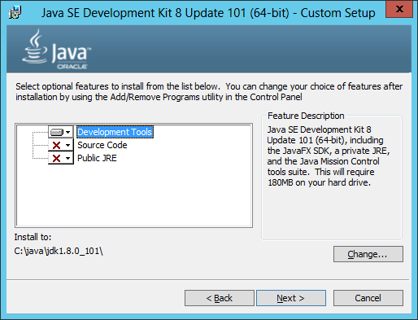
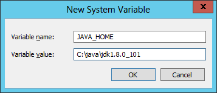
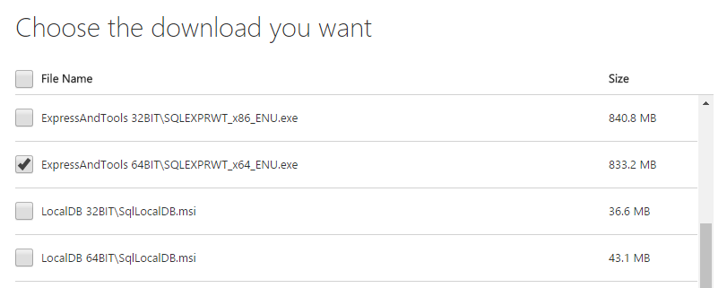
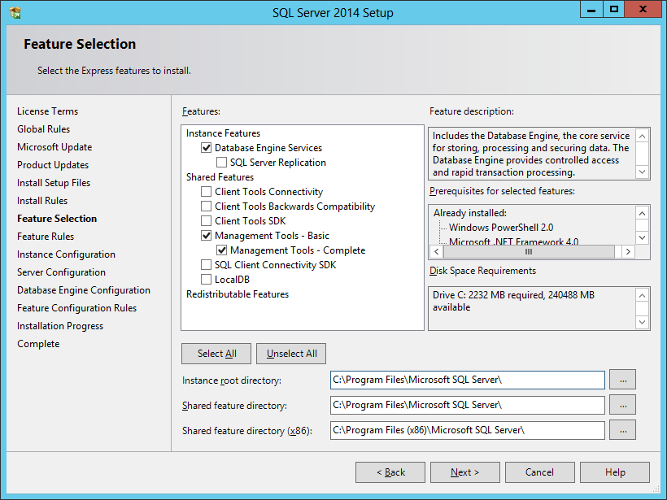
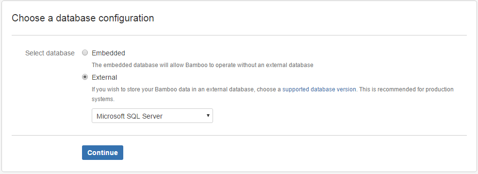
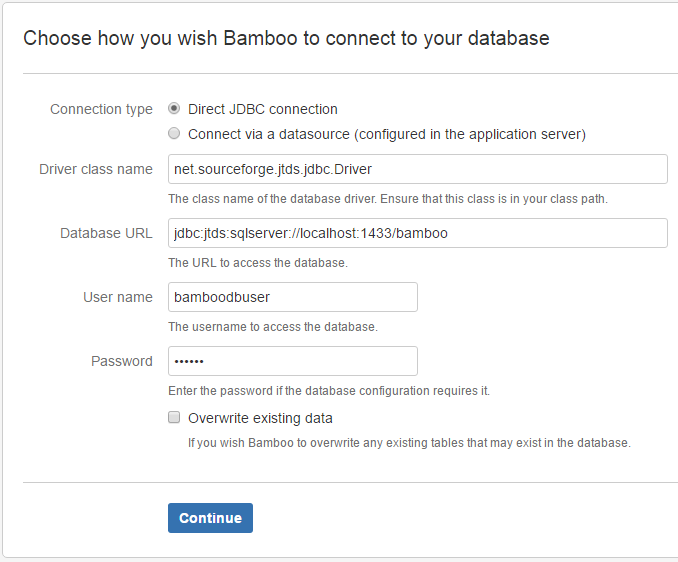

On this post I will describe my experience step by step installing Atlassian Bamboo on Windows with SQL Server as database.

This installation was done following the official documentation: [https://confluence.atlassian.com/bamboo/installing-bamboo-on-windows-289276813.html](https://confluence.atlassian.com/bamboo/installing-bamboo-on-windows-289276813.html)

## Requirements

You can check the current Bamboo supported versions in the following Atlassian confluence page: [https://confluence.atlassian.com/bamboo/supported-platforms-289276764.html](https://confluence.atlassian.com/bamboo/supported-platforms-289276764.html)

In this case we have a clean Windows Server 2012 Standard installation. Our first steps are the installation of the JDK and SQL Server.

## Install Prerequisites

### JDK

First of all we want to install Java. In this case Oracle JDK, you can find the latest version in: [http://www.oracle.com/technetwork/java/javase/downloads/jdk8-downloads-2133151.html](http://www.oracle.com/technetwork/java/javase/downloads/jdk8-downloads-2133151.html)

The latest version at the moment of this write is JDK 8 update 101 (`jdk-8u101-windows-x64.exe`)

> In this case we will only install the Development Tools and change the default installation directory to `C:\java\jdk1.8.0_101` 
> This is completely optional, mainly because I don't like spaces in paths but you can leave the default configuration unchanged.

After you follow the wizard steps and finished the Java installation we just only need to define the JAVA_HOME environment variable

- Go to System (Windows+X and then Y in Windows 8+ or Windows Server 2012+)
- Advanced system settings
- Select Advanced tab
- Click on Environment Variables button
- Click on New button

We can test the Java configuration just by opening a console window and run:

    echo %JAVA_HOME%

or:

    %JAVA_HOME%\bin\java -version
    java version "1.8.0_101"
    Java(TM) SE Runtime Environment (build 1.8.0_101-b13)
    Java HotSpot(TM) 64-Bit Server VM (build 25.101-b13, mixed mode)

### SQL Server

We choose to use SQL Server 2014 as data store. Bamboo is nos restricted to SQL Server we can use any other supported provider like Postgre, MySQL or even the default HSQL database (not recommended for production environments)

#### Install

Download SQL Server 2014 Express from the [official site](https://www.microsoft.com/en-US/download/details.aspx?id=42299)

We want to install SQL Server Management Studio alongside with the database engine so we choose the Express and Tools installer option. 

But you can install just the DB Engine. In fact that should be the default option when you install it in a dedicated server. Here for simplicity we are installing the DB and Bamboo in the same server.

> **Note:** If you (like me) receive a "Microsoft .NET Framework 3.5 Service Pack 1 is required" error message (remember that we are installing Bamboo in a fresh installation of Windows Server) You will have to pause the installation process and go to:
>
> - Server management
> - Add Roles and Features
> - Features
> - .NET Framework 3.5 Features
> - Install
>
> After a moment the installatation of .NET 3.5 will finish and you can click on re-run the SQL Server installer analysis to continue with the SQL Server installation process

#### Configure

You can configure the server with the default user or Windows Authentication. In this case we will create a specific `bamboobduser`

- Security
- New Login
- of type SQL Server Authentication

Next we have to create a database for Bamboo. Remember to Configure the database with a case-sensitive collation (e.g. `Latin1_General_CS_AS`)

You can configure the collation from the New Database dialog:

- Options
- Collation
- By default is `<default>` (in my case `SQL_Latin1_General_CP1_CI_AS`) you can change it to `Latin1_General_CS_AS` for example

Configure bamboobduser as bamboo db_owner, go to:

- Security
- Logins
- Properties of the user
- User Mapping

Last we have to configure the database to use the correct isolation level by running the following SQL script:

    ALTER DATABASE <database name> SET READ_COMMITTED_SNAPSHOT ON WITH ROLLBACK IMMEDIATE;

To verify the changes you can run the following query:

    SELECT sd.is_read_committed_snapshot_on FROM sys.databases AS sd WHERE sd.[name] = '<database name>';

It should return a single record `is_read_committed_snapshot_on` with value `1`

The reason for this last chage is because JDBC is generally simpler and the recommended method to configure Bamboo with SQL Server

## Bamboo Install

First we have to download Bamboo [https://www.atlassian.com/software/bamboo/download](https://www.atlassian.com/software/bamboo/download)

The latest version at the moment of this write is: 5.12.3.1 build 51215 - 04 Jul 16

The installation process is very straighforward. Just follow the wizard steps. There is only two concepts that we can pay attention and define if we will use the default options or change them: installation and home directory 

Installation directory: This is the directory where Bamboo's application files will be installed. The default is: `C:\Program Files\Bamboo`

We changed it to: `C:\atlassian\bamboo\base`

Bamboo home directory: This is the directory where Bamboo will store its configuration data. The default is: `C:\Users\<current-user>\bamboo-home`

In our case and following the previous path: `C:\atlassian\bamboo\home`

> It could be configured with any path. Just remember to avoid include the home in the same path as the installation directory 

### Run Bamboo as a service

You have to open a console window as an Administrator and run [bamboo-install-dir]\bin\service.bat

In our case:

    C:\atlassian\bamboo\base\bin\service.bat
    Installing the service 'Bamboo' ...
    Using CATALINA_HOME:    "C:\atlassian\bamboo\base"
    Using CATALINA_BASE:    "C:\atlassian\bamboo\base"
    Using JAVA_HOME:        "C:\java\jdk1.8.0_101"
    Using JRE_HOME:         "C:\java\jdk1.8.0_101\jre"
    Using JVM:              "C:\java\jdk1.8.0_101\jre\bin\server\jvm.dll"
    The service 'Bamboo' has been installed.
   
- Run services.msc   
- Configure "Atlassian Bamboo Bamboo" startup type to Automatic and Start the service    

> We are using the default user. You can create and configure the service with a specific (restricted) bamboo user

Now you should be able to navigate to http://localhost:8085 

> Bamboo default port is 8085. To change it you can edit the administration.xml file in bamboo home directory: 
>
>   $BAMBOO_HOME/xml-data/configuration/administration.xml. 
>
>   C:\atlassian\bamboo\home\xml-data\configuration\administration.xml in our case.
>
>       <myBaseUrl>http://[host-ip]:[port]</myBaseUrl>
>
>
>   Also you will have to change: 
>
>   $BAMBOO_INSTALL/conf/server.xml. 
>
>   C:\atlassian\bamboo\base\conf\server.xml in our case
>
>       <Service name="Catalina">
>       <Connector
>           protocol="HTTP/1.1"
>           port="[port]"
>           ... 

### Firewall 

Enable TCP port 8085

You can configure it through Control Panel > Windows Firewall with Advanced Security 

Or opening a console as and administrator and run:

    netsh advfirewall firewall add rule name="bamboo" dir=in action=allow protocol=TCP localport=8085 

## Bamboo Configuration

### License

When you navigate to http://localhost:8085 as a first step you have to enter your license: you can request a 180 days [evaluation license](http://www.atlassian.com/ex/generatelicense.jspa?product=bamboo&version=5.12.3.1&build=51215&edition=&sid=BSHO-0GG9-6L1R-L4CZ&ref=prod)

Also you have the option to make an Express Installation or Custom Installation. We take the custom path.

### Paths

Next you can define system path directories like Configuration, build data, working and artifacts directory. For example you can configure build working (source code checkout directories) or artifacts directory to a different hard disk, etc
In most cases default options here are just fine.

### Database configuration

Choose database configuration. In this step we want to configure our SQL Server database.

Select External and from the combobox Microsoft SQL Server:

### Database connection configuration

On the next step we have to configure the database connection parameters:

- Connection type: Direct JDBC connection
- Driver class name: net.sourceforge.jtds.jdbc.Driver
- Database URL: jdbc:jtds:sqlserver://localhost:1433/bamboo

> if you have the database in another server here you have to configure it jdbc:jtds:sqlserver://[host-ip]:[port]/[database-name]

- User name: bamboodbuser
- Password: 

### Finalising

Click continue and Bamboo will take a moment to create all the tables and initialize the database.

In the next step we select to Create a new Bamboo home

Setup an administrator user and that's it we should be ready to implement continuous integration/continuous delivery with Bamboo.

## Next steps

In future posts we can see how to configure build agents and create continuous integrations and deployment plans.

## Update: SMTP configuration

In my case I have created and configured an outlook account for notifications.

Go to Communication > Mail server

Basically the required configuration is:

from	[no-reply-account]@outlook.com
username [no-reply-account]@outlook.com
serverName	smtp-mail.outlook.com
port	587
use tls true

|       Key      |              Value             |
|:--------------:|:------------------------------:|
| From address   | [no-reply-account]@outlook.com |
| Email settings | SMTP                           |
| SMTP server    | smtp-mail.outlook.com          |
| SMTP port      | 587                            |
| Username       | [no-reply-account]@outlook.com |
| Use TLS        | True                           |

