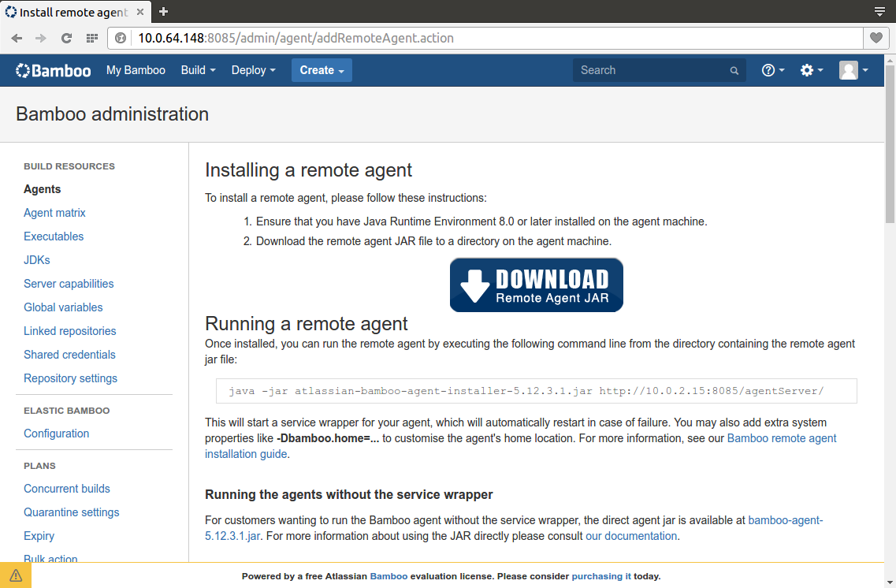
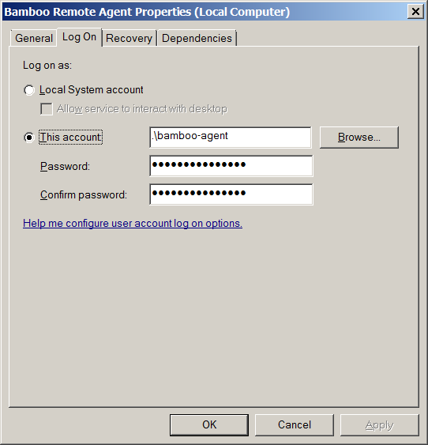
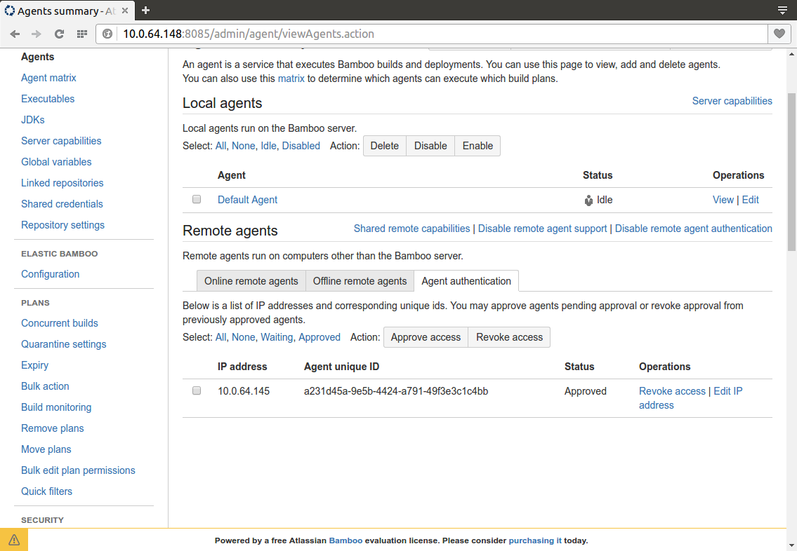
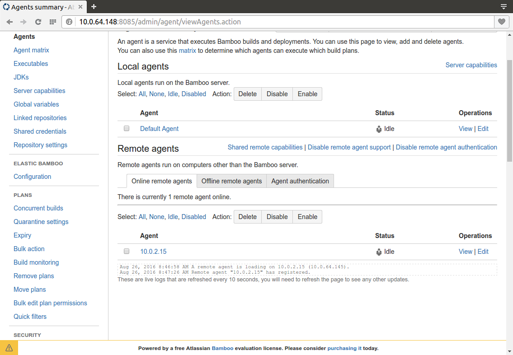

# Based on

[https://confluence.atlassian.com/bamboo/bamboo-remote-agent-installation-guide-289276832.html](https://confluence.atlassian.com/bamboo/bamboo-remote-agent-installation-guide-289276832.html)

[https://confluence.atlassian.com/bamboo/additional-remote-agent-options-436044733.html](https://confluence.atlassian.com/bamboo/additional-remote-agent-options-436044733.html)

# Requirements

## JDK

To avoid any version conflict it's recommended to install the same JDK version as the Bamboo Server.

Define `JAVA_HOME` environment variable and optionally add %JAVA_HOME%\bin to `PATH` then you should be able to run in any command prompt:

    java -version
    java version "1.8.0_101"
    Java(TM) SE Runtime Environment (build 1.8.0_101-b13)
    Java HotSpot(TM) 64-Bit Server VM (build 25.101-b13, mixed mode)

## Bamboo Agent User

You can run the agent as an administrator. For different reasons we prefer to create a specific non-admin user for the agent

    Computer Manager > Local Users and Groups > Users > New User...

## Agent JAR

To install the agent you have to login to the Bamboo server as an admin and navigate to:

    Administration > Overview > Agents > Install Remote Agent

    http://[host]:[port]/admin/agent/addRemoteAgent.action

and click on Download Remote Agent JAR giant button

## Firewall Ports

The traffic between agent and server is bi-directional, however initial connections are only sent from agent to server. Responses are sent from server to agent.
The server has 2 urls / ports to connect with a remote agent.

Default Bamboo base url: `http(s)://<host>:8085/<bamboo-app-context>`  
Default Bamboo broker url: `tcp://<host>:54663`

You can open those ports on the Bamboo Server from Control Panel > Windows Firewall or from a command prompt:

    netsh advfirewall firewall add rule name="bamboo-agent-base" dir=in action=allow protocol=TCP localport=8085 

    netsh advfirewall firewall add rule name="bamboo-agent-broker" dir=in action=allow protocol=TCP localport=54663 

# Run the Agent

Two options: from command prompt or as a Windows service.

## From command prompt

You can run the agent from the command prompt:

    java -jar atlassian-bamboo-agent-installer-5.12.3.1.jar http://[bamboo-server-ip]:[bamboo-server-port]/agentServer/

By default it creates a bamboo-home folder in the user home `%USERPROFILE%`\bamboo-home. You can change the default folder adding the bamboo.home command line option. Example:

    java -Dbamboo.home=C:\atlassian\bamboo\home -jar atlassian-bamboo-agent-installer-5.12.3.1.jar http://[bamboo-server-ip]:[bamboo-server-port]/agentServer/

Another interesting configuration is the disable agent auto capability detection feature. It's useful to let bamboo auto-detect agent capabilities but also you can end with different definitions for the same JDK: JDK, JDK 1.8_101, JDK 1.8 for example.

To avoid that you can enable the following configuration in the `[bamboo-home]\conf\wrapper.conf` file

    wrapper.java.additional.3=-DDISABLE_AGENT_AUTO_CAPABILITY_DETECTION=true

## As a Windows service

Go to `[bamboo-home]/bin` and run `InstallBambooAgent-NT.bat` as an administrator

You can open the Services management console from Adminitrative Tools or running `services.msc` look for Bamboo Remote Agent service an configure the Logon credentials with our bamboo-agent user.
    

Extra service configuration can be defined in the `[bamboo-home]\conf\wrapper.conf` file   

    # The Bamboo Agent home configuration file
    wrapper.java.additional.1=-Dbamboo.home="C:\atlassian\bamboo\home"
    wrapper.java.additional.2=-Dbamboo.agent.ignoreServerCertName=false
    wrapper.java.additional.3=-DDISABLE_AGENT_AUTO_CAPABILITY_DETECTION=true

# Bamboo Server

## Approve the Agent

In Bamboo Server as an admin go to Agents > Agent authentication

You have to explicitly approve the agent.

## Done

That's it, after a couple of seconds you should see the agent in the Online remote agents section.

In a future post we can see how to add capabilities to an agent and for example specialize it to a particular technology.