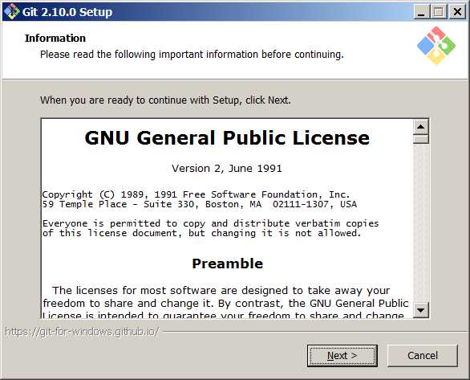
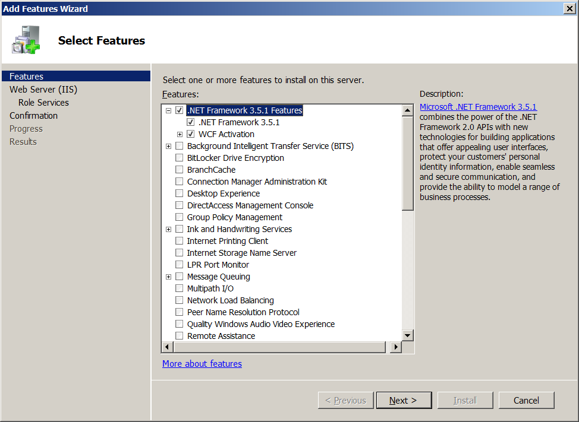
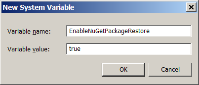
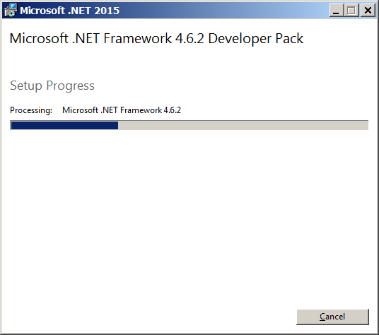
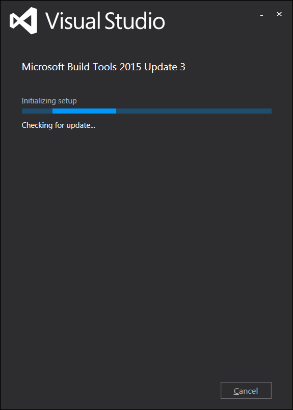
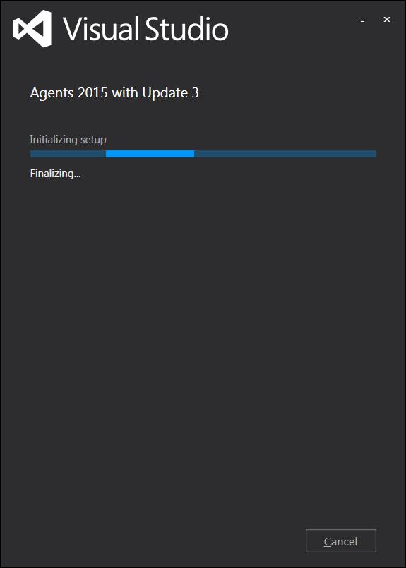
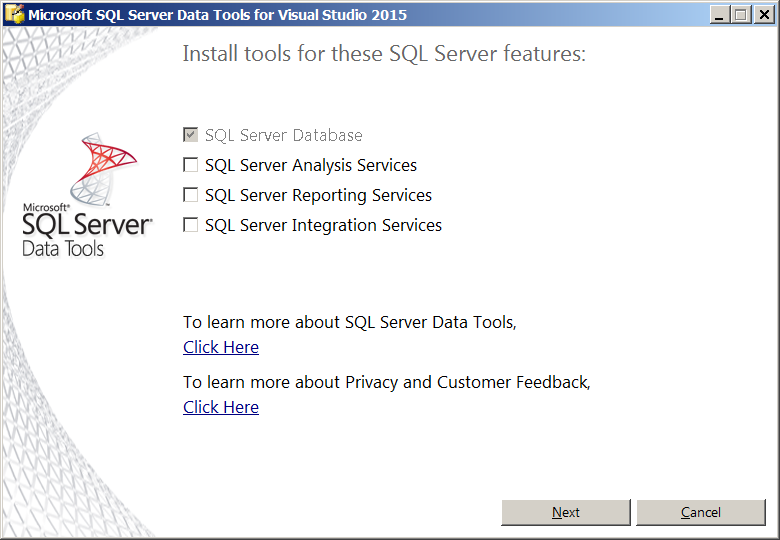
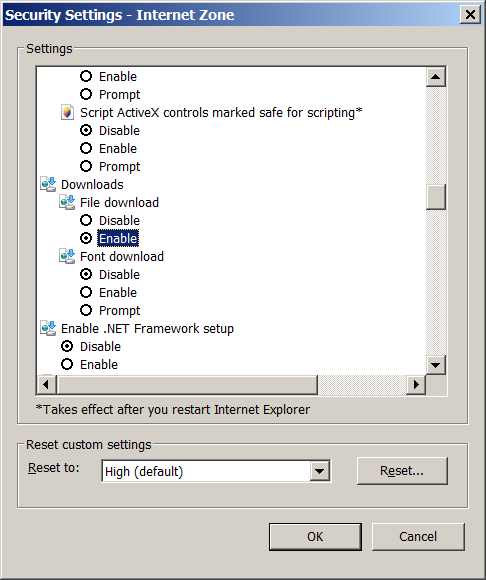

# Bamboo .NET Agent setup

In this post we will see how to setup a Windows Agent to build .NET solutions.

Prerequisites: a Bamboo Server & Agent already configured. 

[https://mamcer.github.io/2016-12-11-bamboo-windows-install/]()  
[https://mamcer.github.io/2016-12-20-bamboo-windows-agent-installation/]()  

The example in this post it's based on a Windows Server 2008 R2 SP1.

> Most of this tools can be downloaded from [www.visualstudio.com](https://www.visualstudio.com/downloads/download-visual-studio-vs) Tools for Visual Studio section

## Install GIT

Extend support for the built-in Bamboo agent Git support.

[https://git-scm.com/]()

## Add .NET 3.5.1 features

Server Manager > Features > Add Feature  (.NET Framework 3.5.1. Features)

## Nuget

You can download nuget.exe and add it as a command capability in Bamboo. The latest version at the moment of this write is nuget v3.4.4

Also you can configure EnableNuGetPackageRestore=true environment variable.

System Properties > Advanced System Settings > Environment Variables > New System Variable

> You need to restart the agent service to apply any change to the system environment  variables

## .NET Developer Pack

Download and install .NET Developer Pack. The latest version at the moment of this write is: Microsoft .NET Framework 4.6.2 Developer Pack

The Microsoft .NET Framework 4.6.2 Developer Pack installs the .NET Framework 4.6.2, .NET 4.6.2 Targeting Pack and .NET 4.6.2 SDK.

`NDP462-DevPack-KB3151934-ENU.exe`

[Microsoft Download Center link](https://www.microsoft.com/en-us/download/details.aspx?id=53321)

## Build Tools

Include the essential tools for building managed applications. The latest version at the moment of this write is: Microsoft Build Tools 2015 Update 3

`buildtools_full.exe`

    C:\Program Files (x86)\MSBuild\14.0

[Download link](https://go.microsoft.com/fwlink/?LinkId=615458)

## Agent for Visual Studio 2015

Agents for Visual Studio Update 3

`vstf_testagent.exe`

[Download link](https://go.microsoft.com/fwlink/?LinkId=615472&clcid=0x409)

## SQL Server Data Tools

SQL Server Data Tools in Visual Studio 2015 version: 14.0.60812.0

`SSDTSetup.exe` 

[Download Link](https://msdn.microsoft.com/en-us/mt186501)

Remember to unblock the installer first.

If you (like me) get an error message almost immediatly after the install process starts then you most probably need to enable file download. 

Internet Options > Security > Custom level... (Enable File download)

## Summarizing

We have installed .NET framework 4.6.2, MSBuild and test tools. Also SQL Server Data Tools which has installed Visual Studio Shell.

We should have the necessary tools to build basic .NET solutions.

On the next post we should see how to configure Bamboo and our first .NET build.