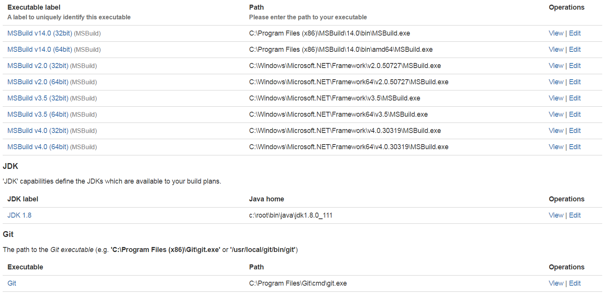
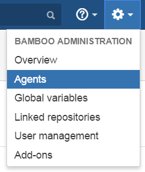
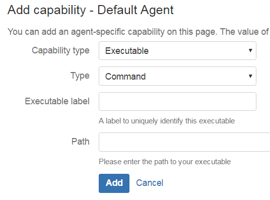
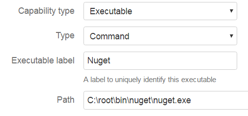
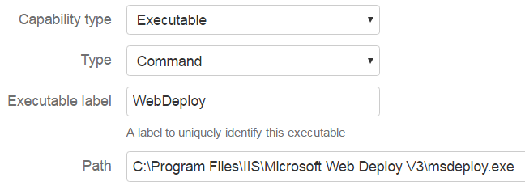
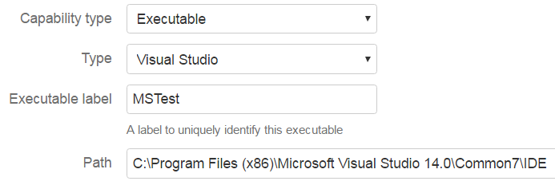
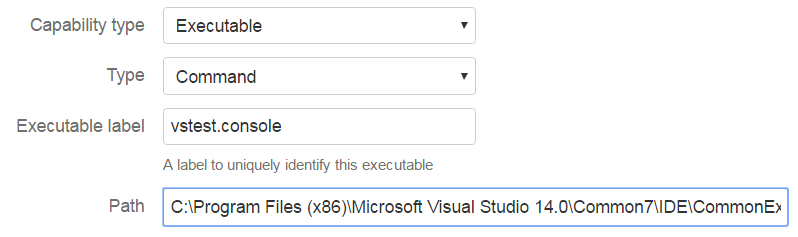
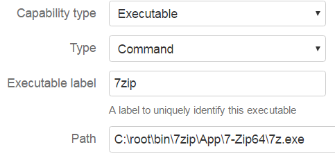
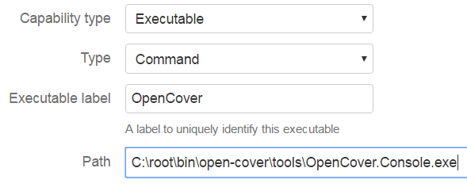
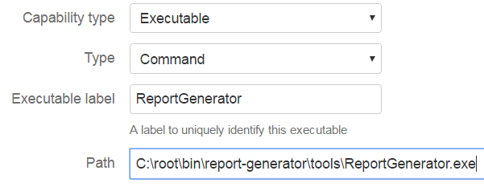

## Initial State

After the [Bamboo .NET Agent Setup](https://mamcer.github.io/2016-12-24-bamboo-net-agent/) 

This should be the initial state:

The following is a list of tools to install and configure in Bamboo in order to support .NET builds.

## Add Capabilities

In Bamboo you can add a capability to an agent going to Administration > Agents

Then select the agent where you want to add the capability and click in Add capability option

Most of the capabilities described below will be added as a Command. Capability type: Executable, Type: Command

With the exception of MSTest which is configured as Type Visual Studio

## Nuget

Install the [nuget command line client](https://dist.nuget.org/win-x86-commandline/latest/nuget.exe)

As a Command we will configure the Nuget capability. 

Nuget as a command will allow us to explicitely install and restore packages in our plans.

## WebDeploy

Again as a Command we will configure WebDeploy.

WebDeploy is the recommended tool to deploy an ASP .Net Web Application. We will use it to deploy our web applications to remote web servers hosting IIS.

## MSTest

As a Capability Type Executable but of type Visual Studio in this case we will configure MSTest.

MSTest is kind of the legacy way of running .NET unit tests. We configure it for that support. But in most cases we will be using vstest.console.exe as is the recommended option introduced with Visual Studio 2012 and with many improvements and functionality not supported in mstest. [More info](https://msdn.microsoft.com/en-us/library/ms182486.aspx)

## vstest.console

As another Command we will configure VSTest.Console.

vstest.console will be our default option to execute our unit tests

## 7zip

Another command for 7zip

[7zip](http://www.7-zip.org/download.html) command line is very useful to compress files and folders and share them as Bamboo artifacts for example.

## OpenCover

Another command for OpenCover

[OpenCover](https://github.com/opencover/opencover) is my default option to measure the code coverage of unit tests. You can install the latest version with nuget as part of your plan but I find useful to have a default option configured as a capability.  

## ReportGenerator

Another command for ReportGenerator

[ReportGenerator](https://github.com/danielpalme/ReportGenerator) is a perfect companion for OpenCover to generate "human friendly" html reports of the results.  

## Summary

This is my basic configuration to build, test, deploy, compress artifacts, measure code coverage and generate quick html reports. I was experimenting with some .cmd files to simplify the unit test, code coverage and report generator process. I can include and explain them in a future post.
