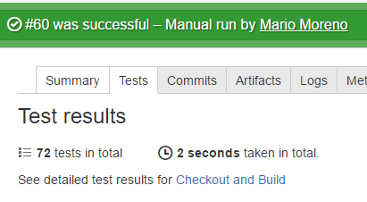

## Introduction

I found useful to configure different tools and batch files as Commands in Bamboo. To support and easily configure my build plans later.

There is a basic list of tools and their configuration, also some of them are based on different batch file created by me that you can find in this repo.

## 7zip

It's always useful to compress stuff and make it available as an artifact for example.

You can configure 7zip as a command in Bamboo and use it in your plans. The basic workflow is compress stuff, delete previous zip files (to avoid adding new files to an existing file container) and uncompress stuff.

### 7zip as a Bamboo Command

After configuring 7zip as a command in Bamboo. Then you can for example create a zip file with the output of a build making it available to following stages.

parameters: 

    a -r -y -xr!.git -xr!obj build-output.zip

> In the example we are adding to an archive, recursively, assumming yes to all queries and exluding the .git and obj directories

### Delete previous zip file

Unless we are forcing a clean checkout in every build (it takes longer so usually it's avoided) then we can be in the situation were a zip file from a previous build exists. In that case the `-a` (add content) option will update the file with the new content, situation that usually is not what we are looking for. In that case is recommended to add a script task before the 7zip task to delete any previous zip file

An example in a Windows environment:

    IF NOT EXIST build-output.zip GOTO NoZip
    erase build-output.zip
    :NoZip 

### Unzip file

parameters:

    x -y build-output.zip 

## Nuget

From Nuget 2.7+ and Visual Studio 2015 the default option to restore packages in a solution is Automatic Package Restore. Previously Visual Studio usually includes a .nuget folder with a copy of nuget.exe. With the current default option you need to explicitely run nuget restore before a build.  

### Command

One way to execute Nuget in Bamboo is through a command task:

Configuring Nuget as Executable

You can restore packages with the `restore` argument or install new packages with `install`. For Example if you want to install the latest OpenCover package you have to configure as argument `install OpenCover` and it will download and create an OpenCover folder with the package content in the current directory. By default the current directory is the Bamboo working directory (${bamboo.build.working.directory}) you can change it specifying a Working sub directory in the same task.

### System Path

Nuget can also be included in the System Path environment variable. Then for example you can call it from a script task:

    nuget restore
    nuget install Newtonsoft.Json

### Local Nuget

If for some reason you need the latest and greatest nuget version you can download it using the following Powershell script. 

    $sourceNugetExe = "https://dist.nuget.org/win-x86-commandline/latest/nuget.exe"
    $targetNugetExe = "${bamboo.build.working.directory}\nuget.exe"
    Invoke-WebRequest $sourceNugetExe -OutFile $targetNugetExe
    Set-Alias nuget $targetNugetExe -Scope Global -Verbose

Remember to check te Run as Powershell script option in the Bamboo script task.

## OpenCover

OpenCover is a code coverage tool for .NET 2 and above (WINDOWS OS only), support for 32 and 64 processes with both branch and sequence points.

### OpenCover as a Bamboo Command

You can configure OpenCover as a Command in Bamboo and explicitely specify the arguments.

### OpenCover from System Path

You can add OpenCover executable to the Windows system Path environment variable. Then for example you can create a script task that calls OpenCover.exe directly.

     OpenCover.Console.exe -register:user -target:"${bamboo.build.working.directory}\packages\xunit.runner.console.2.1.0\tools\xunit.console.exe" -targetargs:"${bamboo.build.working.directory}\MyProject.Tests\bin\Debug\MyProject.Tests.dll" -filter:"+[*]* -[*.Tests]* -[*.Test]* -[xunit.*]* -[Microsoft.*]*" -output:${bamboo.build.working.directory}\open-cover.xml

> Note that in the previous example we assume xunit.runner.console nuget package is present. We can configure it as a reference of a project or explicitly install it in a previous step using Nuget command.   

You can find a extensive list of command line arguments in the [OpenCover wiki page](https://github.com/opencover/opencover/wiki/Usage)

### OpenCover locally

If for some reason you need a specific version of OpenCover (for example the latest) you can always download it locally and use it later in your build. One way to achieve that is with the Nuget command

The previous example will locally install the latest version of OpenCover (`OpenCover.4.6.519` at the moment of this write)

Following the example you will have an `OpenCover.4.6.519 folder` and then you can execute OpenCover.Console with a script task for example:

    OpenCover.4.6.519\tools\OpenCover.Console.exe -version

## OpenCover.MSTest

I have created a custom OpenCover.MSTest Windows batch file (cmd) and configured it as a command in Bamboo. It basically recursively look for test assemblies from a configured root path and executes a code coverage analysis with [OpenCover](https://github.com/OpenCover/opencover)

### MSTest

Internally it uses MSTest to run the tests and assume tests are written with MS MSTest Framework.

### File Pattern

It look for test assemblies that match the following pattern:

    \**\bin\Debug\*.Tests.dll
    \**\bin\Debug\*.Test.dll

Examples of matching assemblies:

     MyProject.Application.Tests.dll
     MyProject.Web.Test.dll 

### Configuration

The only parameter needed is a directory. The starting point where the script will recursively start to look for test assemblies. In most cases the default directory is the Bamboo working directory then you can configure it with the `${bamboo.build.working.directory}` Bamboo environment variable.

  

### Output

The output of the analysis is a xml file with the coverage results. The file is created at the directory level configured in the previous step. The name of the file is `open-cover.xml` and you can for example expose it as an artifact.

    

> A good improvement would be a generalization of the script. Then you can for example specify with a parameter the test framework: xunit, nunit or mstest for example. 

### Source code

You can find this batch file in the [following repo](https://github.com/mamcer/bamboo-cmd).

## Report Generator

Is a tool that converts XML reports generated by OpenCover, PartCover, Visual Studio or NCover into human readable reports in various formats. More info in the [official site](http://danielpalme.github.io/ReportGenerator)

### Run from system Path

You can configure ReportGenerator in the Windows system Path environment variable on every Windows Agent. Then you can for example call it from a script task:

    ReportGenerator.exe  -reports:open-cover.xml -targetdir:coverage-report -reporttypes:Html 

> A complete list of parameters can be found in the [usage section of the official documentation](https://github.com/danielpalme/ReportGenerator#usage)

### Run using Bamboo Command

You can configure OpenCover as a Command in Bamboo and explicitely specify the arguments.

## Report Generator cmd

I have created a custom report-generator Windows batch file (cmd) and configured it as a command in Bamboo. It takes an Open Cover xml report and produces a html human friendly report.

### OpenCover report

This script assume the existence of an `open-cover.xml` file created in a previous step. You can use the opencover.mstest batch file (configured as a Bamboo command) explained in the previous section to create the file. 

### Configuration

The only parameter needed is a directory. The starting point where the script will look for the open-coverl.xml file and also where it will create the ouput folder with the html report. In most cases the default directory is the Bamboo working directory then you can configure it with the `${bamboo.build.working.directory}` Bamboo environment variable.

  

### Output

The output of the analysis is a `coverage-report` directory containing the html report. The directory is created at the same directory level configured in the previous step. 

You can then for example deploy the content to a web server or add a 7z command task to compress the folder and expose it as an artifact.

### Source code

You can find this batch file in the [following repo](https://github.com/mamcer/bamboo-cmd).

## VSTest.Console

VSTest.Console.exe is optimized for performance and is used in place of MSTest.exe since Visual Studio 2012.

### Run from system Path

You can configure VSTest.Console in the Path environment variable on every Windows Agent. Then you can for example call it from a script task:

    vstest.console.exe  MyProject.Web.Test.dll MyProject.Service.Test.dll /Logger:trx

> A complete list of parameters can be found in the [official documentation at MSDN](https://msdn.microsoft.com/en-us/library/jj155796.aspx)

### Run using Bamboo Command

You can configure VSTest.Console as a Command in Bamboo and explicitely specify the arguments.

## VSTest.Console cmd

With the same goal as open-cover and report-generator I have created a `vstest.console` Windows script (cmd file) and configured it as a Bamboo command. This command look for test assemblies and run all the unit tests.

### File Pattern

When it look for test assemblies it basically look for files that match the following pattern:

    \**\bin\Debug\*.Tests.dll
    \**\bin\Debug\*.Test.dll

Examples of matching assemblies:

     MyProject.Application.Tests.dll
     MyProject.Web.Test.dll 

### Configuration

The only parameter needed is a directory. The starting point where the script will recursively start to look for test assemblies. In most cases the default directory is the Bamboo working directory then you can configure it with the `${bamboo.build.working.directory}` Bamboo environment variable.

  

### Output

The output of the analysis is a trx file with the unit tests run results. You can find it in a `TestResults` directory at the same level as the working directory configured in the previous step. Following this task you can for example configure a MSTest Parser task with the Test Results.

    

That will allow Bamboo show the test run results in the Tests tab of every build result summary

    

### Source code

You can find this batch file in the [following repo](https://github.com/mamcer/bamboo-cmd).

## Final thoughts

This post ended longer than I expected. This is basically how I configured different tasks to help avoid repetitive tasks or the need of manually include a new test assembly path as a parameter when a new test project is included in the solution for example. Hope you find it useful, the script files are available for download. Let me know if you generate new improved versions.  