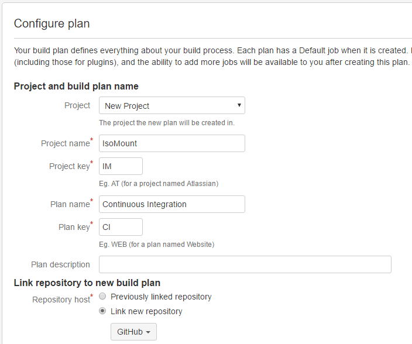
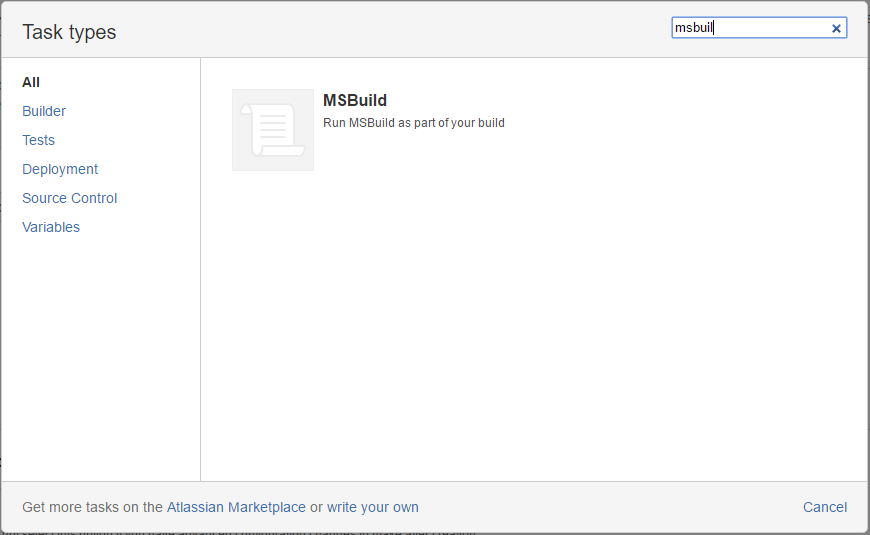
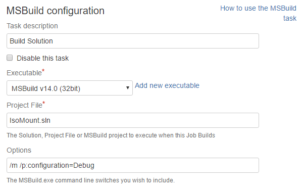
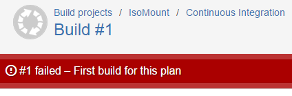
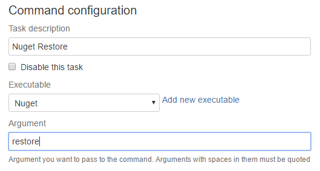
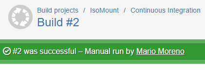
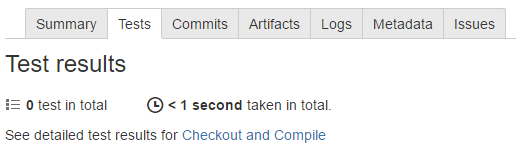
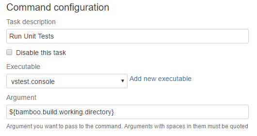
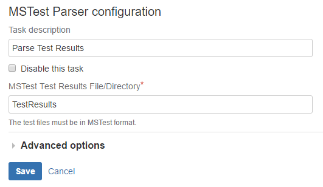
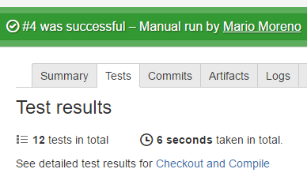

On this post I will describe the configuration of a Continuous Integration plan with Bamboo.

The project is a [simple wrapper for Virtual Clone Drive](https://github.com/mamcer/isomount). A .Net application initially written several years ago. This simple application will serve as a good example about how to configure a Continuous Integration plan in Bamboo.

## Create Plan

First we should create the Plan. In order to do that we should go to Create > Create a new plan option and configure the project name, project key, plan name and plan key. Also we have to configure the source code repository in this case GitHub.

## Configure Tasks 

The next step is to configure the tasks. In this case (just to build the application) we can add one task: MSBuild.

For the configuration of the task we have to  specify the MSBuild executable, solution file name and optionally some parameters.

In this case I've added:

    /m /p:configuration=Debug

To build multiple projects in parallel and to explicitly build in Debug mode. 

## First build

With a source code checkout and a MSBuild task we should be ready to run our first build. Just click enable plan and run.

The result is not what I was expected but the error log is clear enough to easily understand what is happening.

    error : This project references NuGet package(s) that are missing on this computer. Use NuGet Package Restore to download them.  For more information, see http://go.microsoft.com/fwlink/?LinkID=322105.

We have to explicitly restore all of our nuget packages before msbuild. That can be done by running `nuget restore` on the solution folder.

## Nuget

Actions > Configure Plan to add a Command task (in a [previous post](https://mamcer.github.io/2017-02-04-bamboo-cmd-tools/) I have explained how to add nuget as a command along with other executables as Bamboo commands)

The configuration of the Nuget task is very straightforward. A command with nuget configured as executable and `restore` as a parameter.

## Second build

We are ready to run our second build and the results are what we expected in the first try :)

## Unit test

In a Continuous Integration process is very recommended (if not mandatory) to include automated tests as part of our build. We have a green build, that is a good thing but also we have a disturbing 0 in our Test results summary.

> Since in this case our unit tests are written using the default Visual Studio Unit Test framework we can add a Bamboo MSTest task and explicitly configure it with all our test assemblies. I prefer to use a cmd file that recursively look for test assemblies and run VSTest.Console avoiding the explicit setup of the test assembly file paths and the need to remember explicitly add them if for example we add more test projects to the solution in the future. This configuration was explained in a [previous post](https://mamcer.github.io/2017-02-04-bamboo-cmd-tools/).
    
We have to add a new Command task to our Build job. Configure the executable to vstest.console (or the name we choose for the vstest-console.cmd script) and add the Bamboo build working directory variable `${bamboo.build.working.directory}` as a parameter.

After that we can add a MS Test Parser task to see the results in the Test results tab of every build in Bamboo. The only configuration needed is the Test results directory `TestResults` in our case.

## Done

We have a Continuous Integration plan in Bamboo that builds and run our unit tests for every commit to the repository. 

As a next step we can think in include a code coverage analysis of our unit tests, generate a deployment package or a SonarQube analysis. But most of these options are recommended to be included in a separated plan.

With a plan that includes a build and run our unit tests we have a solid option that can be run in a matter of seconds and give us all the benefits of a continuous integration process.   