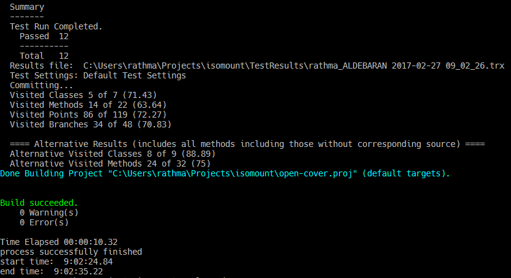
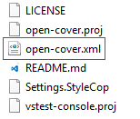
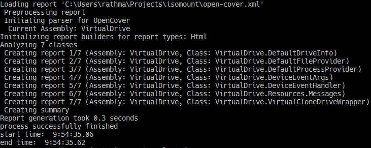
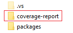
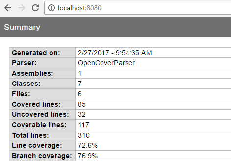

In this post I will describe a very cheap process to calculate unit tests Code Coverage and generate a html report with the results as part of our development process.

I'm using [OpenCover](https://github.com/OpenCover/opencover) and [ReportGenerator](http://danielpalme.github.io/ReportGenerator/). You can directly call them by command line they support several configurations and parameters: [OpenCover Usage Wiki](https://github.com/opencover/opencover/wiki/Usage), [ReportGenerator](https://github.com/danielpalme/ReportGenerator#usage). In this case [I'm using two .cmd files I wrote](https://github.com/mamcer/bamboo-cmd) and usually include in my development projects. The `open-cover.cmd` file recursively look for test assemblies and run opencover to generate an `open-cover.xml` report. The `report-generator.cmd` file take an `open-cover.xml` report as input and generate a `coverage-report` folder with a human friendly html report ready to be deployed to a web server.

> A current limitation of the `open-cover.cmd` script is that it only supports the mstest framework. This can be extended to support all the unit tests frameworks that OpenCover supports: xUnit and NUnit

## Paths

The files are default configured with a directory structure similar to the following:

    Src\
        [MyProject]
    [MySolution.sln]
    Tools\Cmd
        open-cover.cmd
        report-generator.cmd
        vstest-console.cmd
    open-cover.proj
    vstest-console.proj

You can change this in the same files.

The .cmd files need the following configurations:

open-cover.cmd:

    set opencover_bin_path=[OpenCover.Console.exe file path]
    set solution_name=\[MySolution].sln

report-generator.cmd:

    set reportgenerator_bin=[ReportGenerator.exe file path]

> Remember to add the exceptions to the `.gitignore` file

    # coverage report
    coverage-report/

    # open cover report file
    open-cover.xml

## Usage

You can execute the .cmd files at any moment. In my case I Basically have Visual Studio and a console Window opened all the time. Two console Windows to be exact.

> With Windows 10 you can have one Desktop with a full screen console window ready to execute commands

You can develop and write unit tests and when you want to know your code coverage run `open-cover.cmd`

That will produce an `open-cover.xml` file at the solution level with the code coverage analysis results.

This file is not particulary friendly for humans. That is where report-generator can help us. Run `report-generator.cmd`

and almost inmediately we will have a `coverage-report` folder at the solution level with the OpenCover coverage results in a friendly html report

We are almost there, in a matter of seconds we have run a code coverage analysis with OpenCover, generate an xml report and with ReportGenerator convert it to a more human readable html report.

The only thing left is to actually see the web report. We can host it with any webserver (IISExpress for example)

    "C:\Program Files (x86)\IIS Express\iisexpress.exe" -Path:[path-to-coverage-report-folder] -Port:[port]

Or just double click the `index.htm` file included in the folder.

## Conclusion

OpenCover is a powerful free option to calculate code coverage in our .Net projects. In conjunction with report generator we can have friendly html coverage reports in a matter of seconds.

In this post I have explained how to implement a process to continuously calculate the coverage based on two cmd files. But you can always directly call OpenCover and ReportGenerator directly by command line. 

Since the time impact is minimum (directly related with the amount of tests), with little modifications we can think to include this process in a Continuous Integration plan and automatically deploy the html report to a web server to have continuous feedback of our code coverage evolution.