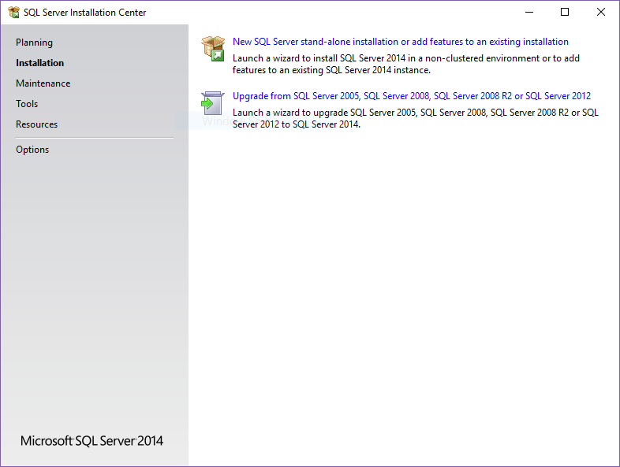
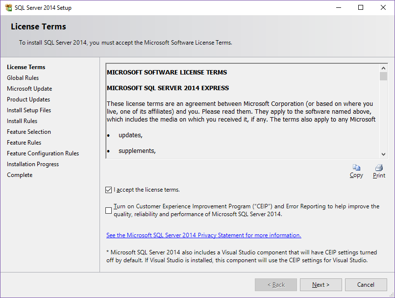
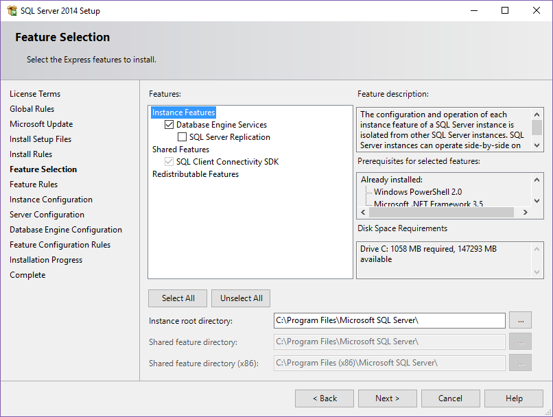
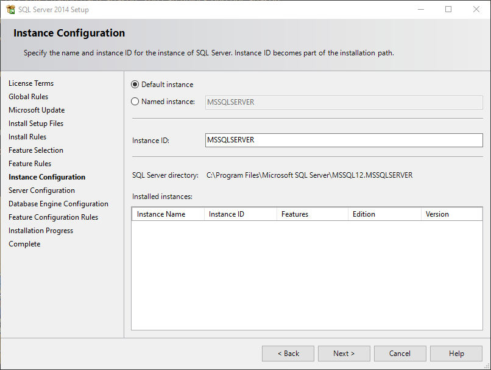
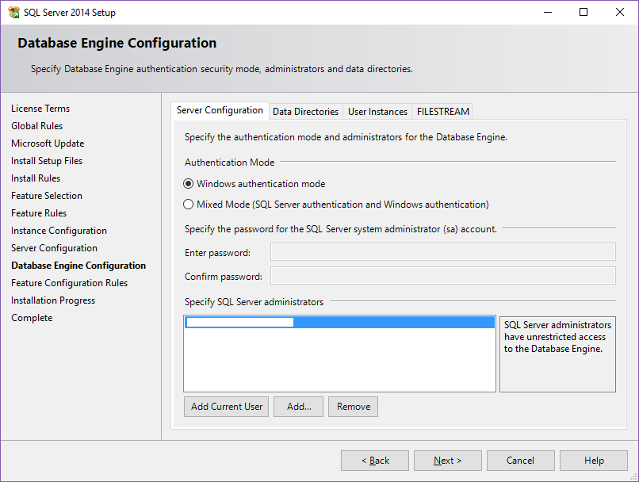
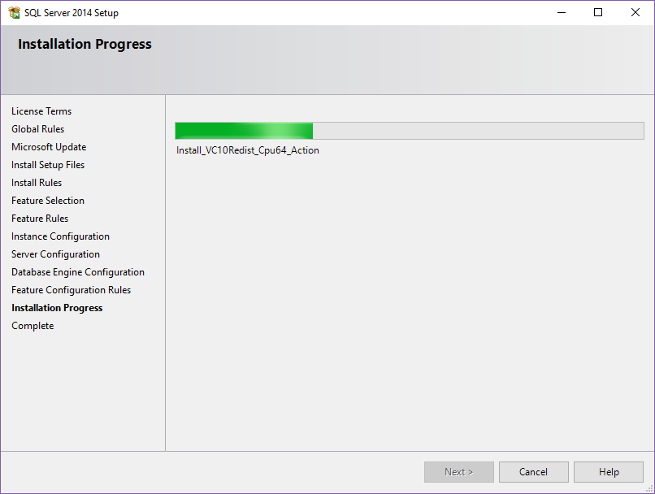
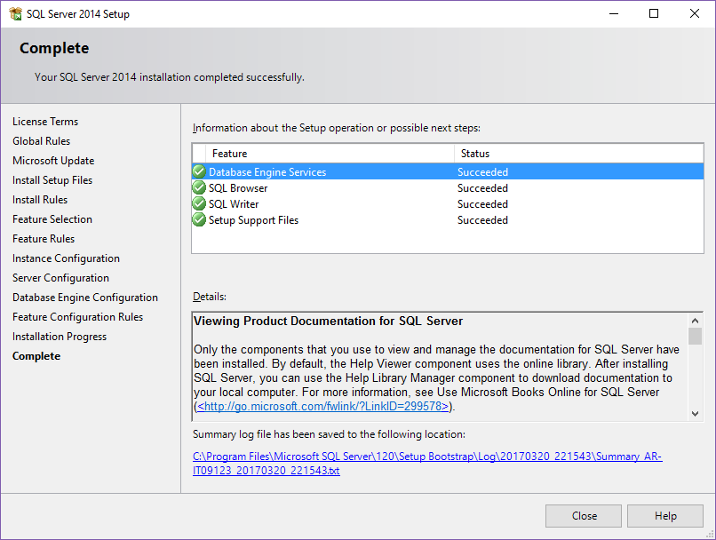
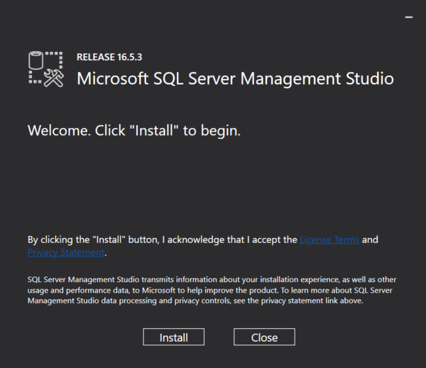
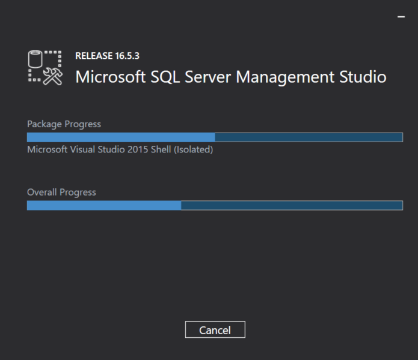
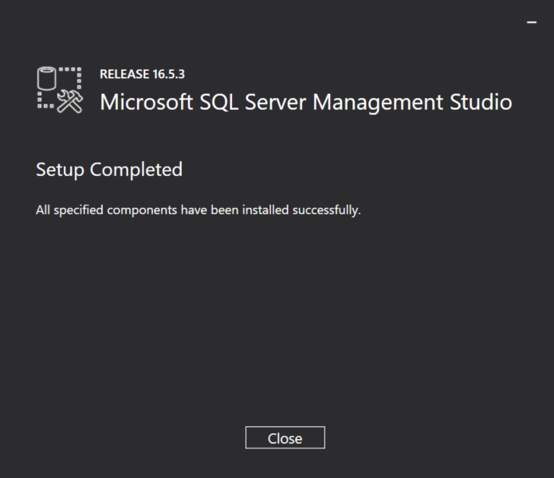

SQL Server Windows Installation (thinking on an installation of JIRA, Bamboo and Crucible afterward)

The installation steps are based on SQL Server 2014 (the current version supported by JIRA and Bamboo) you can download it from the official Microsoft site: [https://www.microsoft.com/en-US/download/details.aspx?id=42299]()

Additionally you can download and install SQL Server Management Studio. 16.5.3 in this case. Again you can download it from the official Microsoft site: [https://msdn.microsoft.com/library/mt238290.aspx]()

## Installation

Click on New SQL Server stand-alone installation...

Accept License

Instance Features

Name the instance. In my case the Default instance name is Ok.  

Instance Collation. Well, this step is important. We should set a case-insensitive, accent-sensitive instance as required by JIRA and Bamboo. 

For example `SQL_Latin1_General_CP1_CI_AS`

In the next step we can configure the Authentication Mode. By default we have Windows authentication, later we can enable also SQL Server authentication. Data directories, etc.

Installation Progress

Success!

## SQL Server Management Studio

Additionally you can install SQL Server Management Studio to connect to your fresh SQL Server instance.

Click on Install

Setup Completed!

##  Firewall

If you are configuring a server (you should install a more complete version than the express) you can configure the Windows Firewall to allow SQL Server access. The default port is 1433.

Windows Firewall > Advanced settings > Inbound Rules > New Rule...

or just run the following command:

    netsh advfirewall firewall add rule name="sql-server" dir=in action=allow protocol=TCP localport=1433 

## Allow Remote Connections

- Enable the TCP/IP protocol

- Security > Server Authentication SQL Server and Windows Authentication Mode

- Configure SQL Server Network Configuration Enable TCP/IP 

- From Management Studio, right click Server > Properties > Connections > Allow remote connections to this server

- Restart Service

## Next

In a following post we can see how to install JIRA, Bamboo and Crucible.