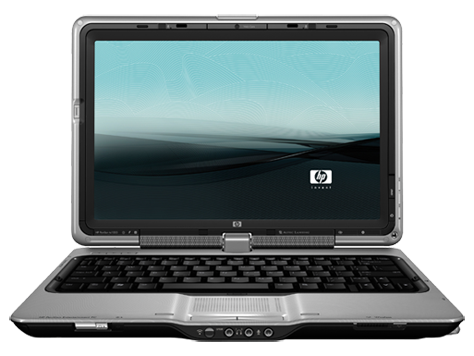
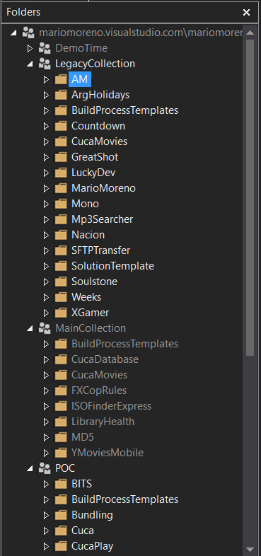

I bought my first laptop in 2008 a [HP Pavilion Tx1330la](https://support.hp.com/us-en/product/hp-pavilion-tx1000-notebook-pc-series/3185026/model/3185027/product-info)

Definitely more prettier than useful, at least for development :)

By that time I was working in a company with hard .NET development background with a corporate Team Foundation Server 2008 as a source control and issue tracker. 

In that context my personal goal was to master .NET development and TFS. I configured a VirtualBox environment with Windows Server 2008 and installed TFS 2008. Then I was able to develop .NET applications with Visual Studio 2008 connected to my local TFS instance. All in my 1GB RAM HP Windows Vista Laptop..

Some of the projects created were later exported to TFS Preview (Visual Studio Team Services). Configured Online Team Build for Continuous Integration, since I was an early adopter I used to have several free minutes of cloud computing.

In 2012 I remember configuring a media center for home. Install XBMC but also (why not) install SQL Server, TFS Express, TeamCity then Jenkins and years later I bought some personal JIRA, Crucible and Bamboo licenses.

In 2013 I decided to fulfil one of my System Engineer student pending things and build one personal desktop computer with a decent budget. Opening the door to more development, VMs, linux, other languages and systems and also play Diablo III with full details :)

I moved my development from TFSVC to Git in the same TFS Online, then to bitbucket and now on github.

I remember to work in a personal agenda, a Truco game in C++, an application that scans the network and enable you to play mp3 files in your browser powered by Silverlight (the future of the web at that moment, at least from MSFT perspective).A WPF application to play several emulated games from different emulators just by double click the name. Etc, etc, etc.

Somehow I managed to always be working in some side project, but looking in retrospective just a minor percentage could be said is finished or nearly finished.

They definitely left a mark on me, knowledge that I mainly applied in my daily work. I think that every side project is a learning journey from the very beginning and for example not all side projects will ever see the door. I definitely had a lot of fun in the developing process, but with time I started to see the importance of basically.. finish things.  

Despite I don't have the free time I used to have I still manage to found some to try a new technology or tinker with at least one side project. But since a couple of years I tried to identify the project at the start point: is it a POC, just a test or an application that could see production?

In my case the development wave used to starts strong with maybe a weekend or nights of intensive coding sessions and then starts to fade with a prototype or the start of another side project. There is a lot of fun and learning in a side project but also there is a lot to learn going to and after production and I'm in that process.
