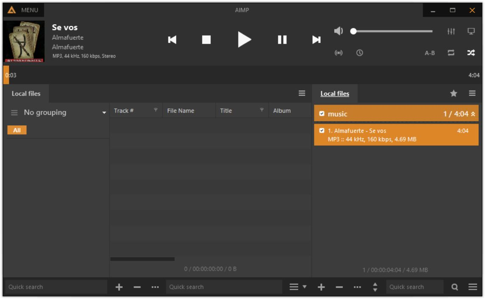
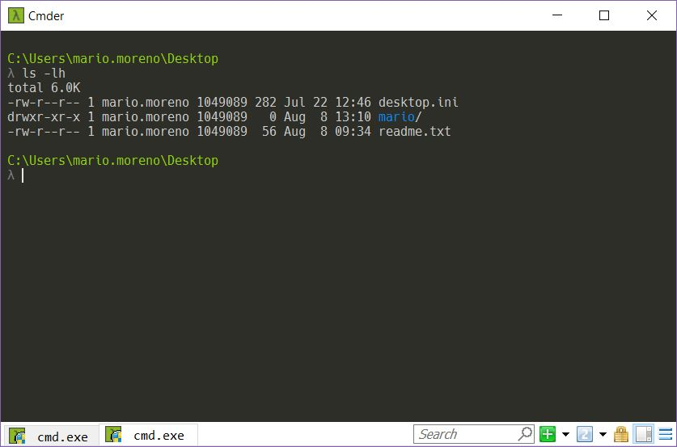
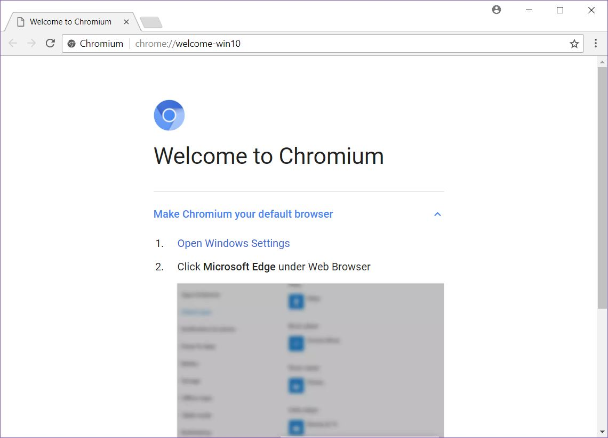
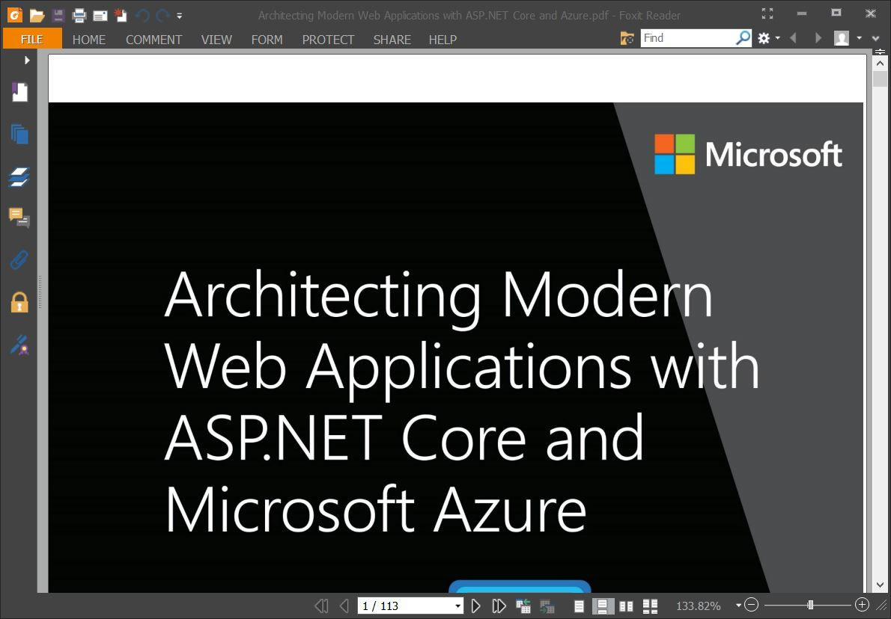
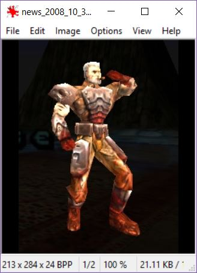
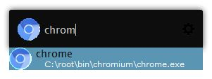
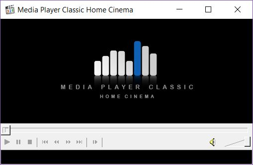
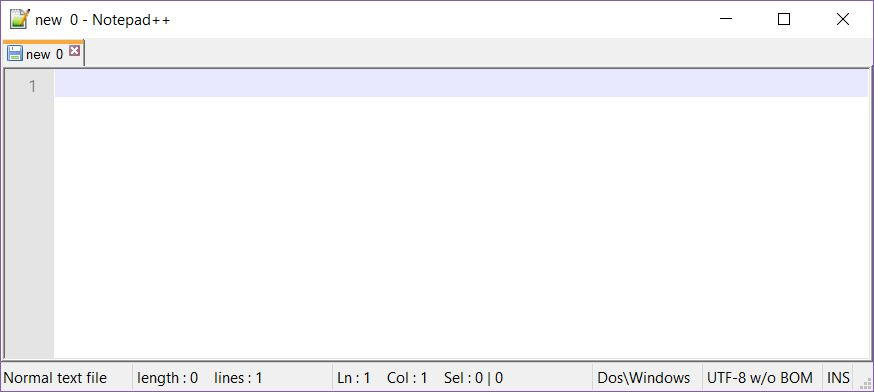
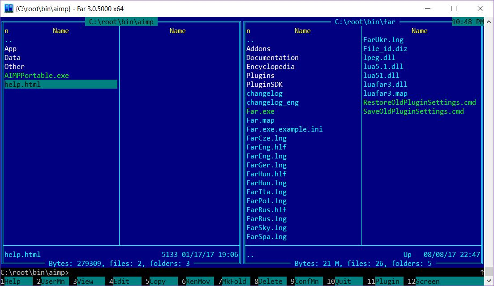

I'm writing this post with VS Code in a Linux Ubuntu 16.04 laptop. But as a .NET developer I spent last fifteen years (and continue at work) working on different Windows based desktop and laptop computers.

Since 2010 I've started to work heavely wit virtual machines and different computers. I ended selecting different old and new tools, looking mainly for portable versions to fit in a little flashdrive. Here is my selection of tools, most of them I use in a daily basis.

## Tools

All these tools are free and have a portable version. You can store them in a flash drive if you want.

### Aimp

[Aimp](http://www.aimp.ru/) is a full-featured music player that support a wide range of differents formats. In my opinion the best features are: resource consumption and the keyboard shortcuts support. I really like to customize shortcuts so I just need to start the program and then control any other action: play/pause, search, stop, etc from the keyboard with almost no context switch. Excellent for coding sessions :)

> Another reason why I've choosen this player is because in different ways (more with the default skin of version 3) it remembers me [Winamp](http://www.winamp.com) my default audio player in early 2000.

### Cmder

[Cmder](http://cmder.net/) it's a relatively recent addition in my list. I really enjoy working with the terminal, the automatization of processes and avoiding bloated IDEs. Windows 10 improved the console emulator after years and years without any change, also the option to install bash in Windows is very interesting. But I really like Cmder features like tabs and git information.

### Web Browser

For years I use Internet Explorer 6, 7 and 8 (¯\_(ツ)_/¯) Firefox back in 2004, Safari for Windows (2007, very buggy) and Chrome. Talking about portable versions I ended with Firefox, Firefox developer and basically [Chromium](https://download-chromium.appspot.com/)

### Pdf Viewer

Today any modern web browser open pdf files. But there was a time where you need a specific pdf viewer program. Adobe Acrobat for example, my choice was [Foxit Reader](https://www.foxitsoftware.com/pdf-reader/). 

### Image Viewer

I'm old fashioned and really dislike bloated program that consume a lot of resources and mostly take an eternity to load. In that context my default image viewer is [IrfanView](http://www.irfanview.com/). Full of features in a lighting fast application with a classic UI.

### Keystroke Launcher

Windows 10 have a very good built in application launcher. But I really like [Launchy](https://www.launchy.net/) and the [Minimal slate](http://octoberdesign.co/downloads/Minimal%20Slate.zip) skin. To start all my portable applications.

## Video Player

I used Gom Player, VLC, but since several years ago my default video player is [mphc](https://mpc-hc.org/).

## Text Editor

My all-terrain text editor is [notepad++](https://notepad-plus-plus.org/) with a clean interface :)

## File Manager

I really like [Total Commander](https://www.ghisler.com/) but you need to buy a license. I found really fun, useful and nostalgic [Far Manager](http://www.farmanager.com/) 

## Mentions

Most of these applications can be downloaded from [Portable Apps](https://portableapps.com). 

Special mentions: 

- [sysinternals](https://docs.microsoft.com/en-us/sysinternals/downloads/sysinternals-suite)
- thunderbird
- tor
- win-merge
- color-cop
- fciv
- ffmpeg
- popman

You can organize the applications in any folder. In particular my directory layout usually looks like:

    C:\root\
        bin\
            aimp\
            chromium\
        home\
            projects\
        tmp\

