In this post I will describe a process to generate and deploy a .NET 4.5 web application (including database) to a Windows Server. This process can be implemented to configure a Continuous Delivery or Deployment process in a Continuous Integration server.

I will describe the process using Atlassian Bamboo as the continuous integration server. Only because is the tool I'm currently using but this process  can be implemented in any other continuous integration server with just a few tweaks.

## Process Overview

- Build and generate a Web application deployment package 
- Generate a dacpac file for database deployment
- Copy Parameters File
- Deploy Database
- Deploy Web Application

All those tasks can be automatized from any console window. In the case of Bamboo the best fit is a plan to generate the package and a deployment project that define different environments and include all the steps to actually deploy the package to the different environments.

In the next steps I will describe that process. 

## Bamboo: Create a regular plan

The first step is to create a regular plan that generates the deployment package.

### Source Code Checkout

For example a Continuous Delivery plan with one stage: `Deploy` and one job: `Generate package`. The first step of almost every plan is a source code checkout from the repository. 

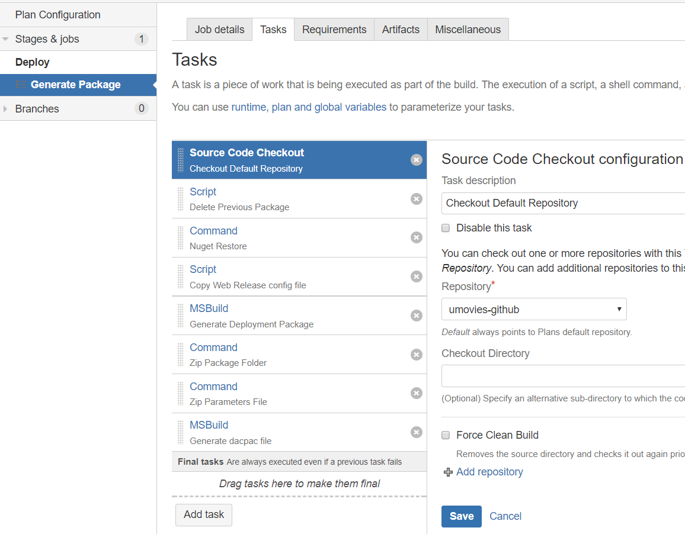

### Delete Previous Package

As I'm using 7zip and to ensure I generate a zip with the latest version of the files. I explicitly delete any previous deployment file. To do that you can include a script task and configure the following script inline.

    IF NOT EXIST deployment-package.zip GOTO NoZip
    erase deployment-package.zip
    :NoZip

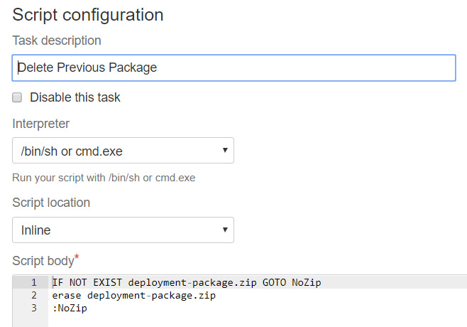

### Nuget restore

Before the build we explicitly call nuget to restore all the solution packages. That can be implemented with a command task that calls nuget with the restore parameter.

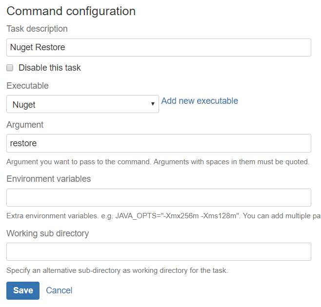

### Copy Web Release config file

To avoid the commit of the Release version of the Web.config in the repository I have copied it to the Continuous Integration server. Different options here: we can include it in another repository with limited access, encrypt some specific keys, etc.

In our case I have included a script task with the following inline configuration.

    copy C:\root\tmp\secrets\UMovies.Web.Web.Release.config Src\UMovies.Web\Web.Release.config

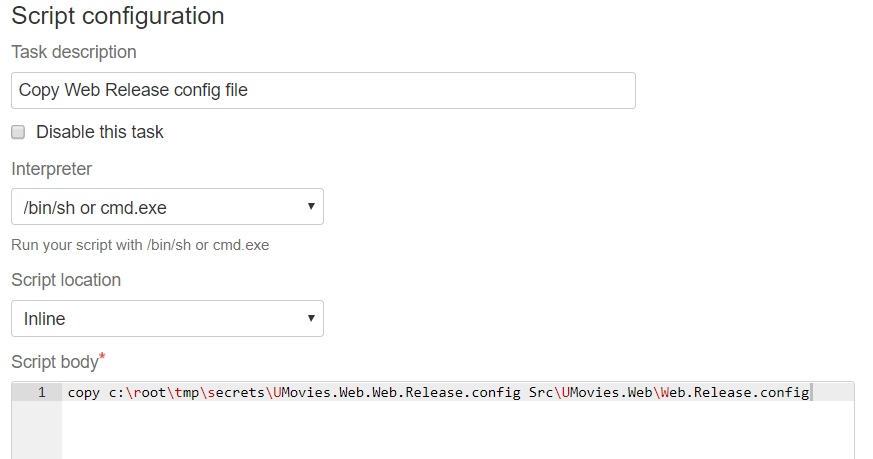

### Generate Deployment Package

The next step is to configure a MSBuild task to generate a deployment Release package (It will automatically use our release config file). The parameters are:

    /p:Configuration=Release /p:DeployOnBuild=true /p:DeployTarget=Package /p:CreatePackageOnBuild=True /verbosity:d

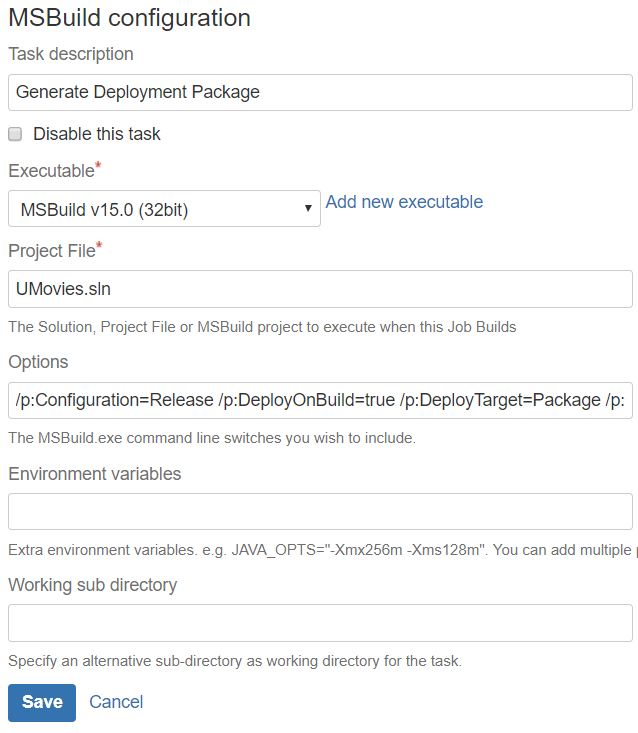

> This action will generate a WebDeploy package ready to be deployed. The files can be found in: `\obj\Release\Package\*.*`. In my case: `Src\UMovies.Web\obj\Release\Package\*.*`

### Zip Package Folder

With a 7zip command task we can generate a zip file that contains all the files included in the deployment package folder

    a -r -y deployment-package-folder.zip Src\UMovies.Web\obj\Release\Package\*.*

### Zip Parameter Files

The parameters file is a xml file where we can define keys and connection strings to parametrize the WebDeploy package. Making it possible to use the same package on different environments. Otherwise we would need to generate a package per environment.

Same as with the release Web config file I have copied the production parameters file in the Continuous Integration server.

    a -r -y parameter-files.zip C:\root\tmp\secrets\*.xml

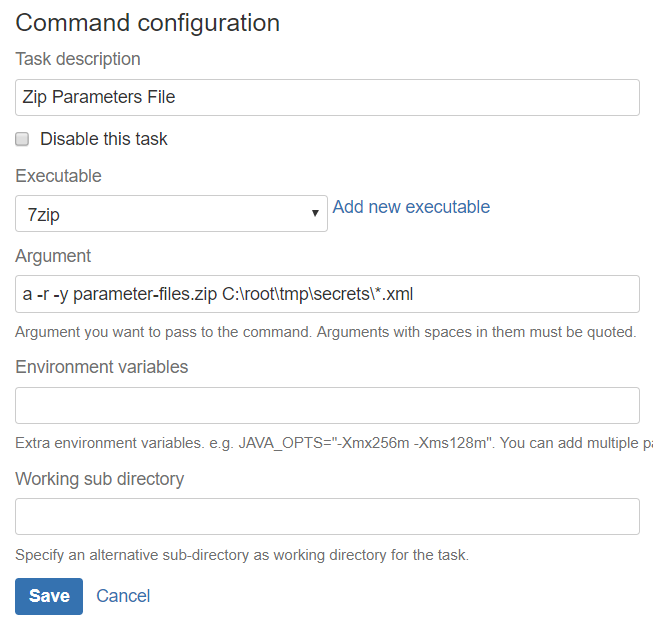

A typical parameters file looks like:

    <?xml version="1.0" encoding="utf-8"?>
    <configuration xmlns:xdt="http://schemas.microsoft.com/XML-Document-Transform">
    <connectionStrings>
        <add name="UMovies" connectionString="Server=[db-server-ip];Database=[database-name];User Id=[user-id];Password=[password]" providerName="System.Data.SqlClient" xdt:Transform="SetAttributes" xdt:Locator="Match(name)"/>
    </connectionStrings>
    <appSettings>
        <add key="SignalrUrl" value="http://[server-ip]:[port]/signalr" xdt:Transform="SetAttributes" xdt:Locator="Match(key)"/>
        <add key="PicturesUrl" value="http://[server-ip]:[port]/pictures" xdt:Transform="SetAttributes" xdt:Locator="Match(key)"/>
    </appSettings>
    <system.web>
        <compilation xdt:Transform="RemoveAttributes(debug)" />
    </system.web>
    </configuration>

### Generate Dacpac file

Last we generate a database deployment Dacpac file. Another msbuild task, with the following parameters in this case.

     /m /t:Rebuild /p:Configuration=Release

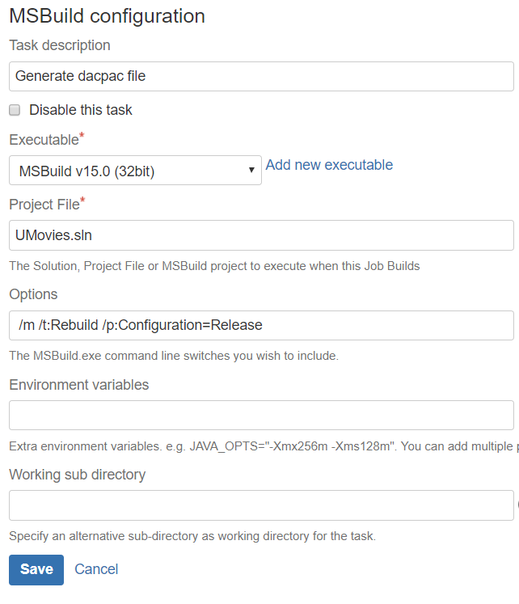

### Artifact Definition

An artifact is a way to share files produced in a Bamboo plan. In our case we will configure different packages to share all the files needed to deploy the application from a deployment plan to a deployment project in Bamboo.

I have defined three different artifacts: dacpac database file, deployment package zip file and parameters zip file.

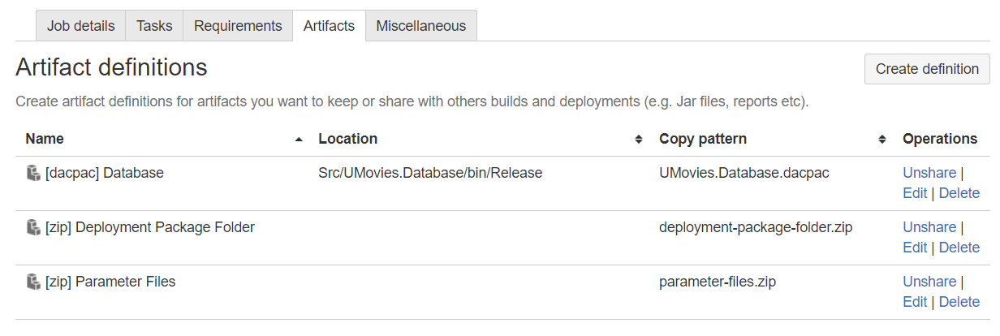

> Remember to configure all the artifacts as Shared so they can later be consumed by the Deployment Project.

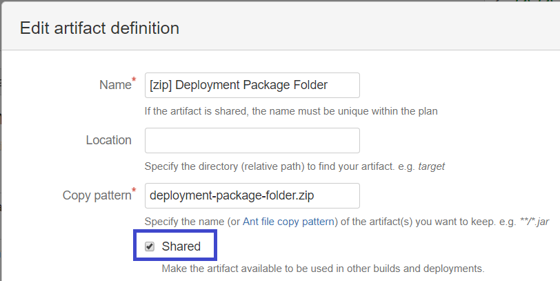

## Deployment Project

The next step is to generate a deployment project and configure the environments to deploy the package generated in the previous step.

### Create Deployment Project

Go to Create > Create deployment project.

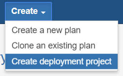

I have defined just one environment `Prod` you can define different environments like: `Dev`, `Staging`, `QA`, etc    

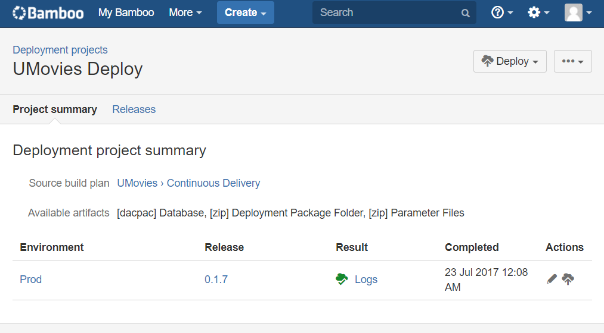

### Default Tasks

By default Bamboo add a `Clean working directory task`, it surely adds a couple of seconds to the plan execution but in most cases it's good to ensure we are working from a clean state.

The second default task is the `Artifact download` task. From the artifact name you can select if you want to copy all the available artifacts or a specific file

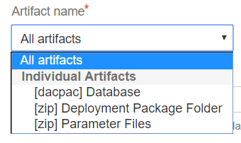

In my case I choose to download all the artifact as I'm going to deploy all the files from the same deployment project.

### Unzip Artifacts

In the case of the zip files we need to add a 7zip command task to unzip and make the files available for use. We can do that in Bamboo with a 7zip command task. 

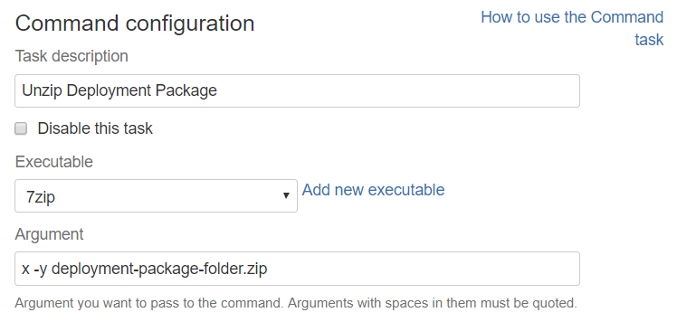

### Database Deploy

First we will deploy our database dacpac file using msdeploy. We need to add a script task and execute msdeploy. 

    msdeploy.exe -verb:sync -source:dbDacFx="%CD%\UMovies.Database.dacpac" -dest:dbDacFx="Data Source=[host];Initial Catalog=[db-name];User ID=[username];Password=[password]"

> In our Continuous Integration server we have conveniently added msdeploy in the path. Otherwise we just need to call it with full path. 

We use the verb:sync, our dacpac file as the source and the connection string to the server as the destination.

### Deploy Web Application

The final task in our deployment project is to actually deploy the Web Application

We need to execute the web deploy cmd file generated in the previous plan with appropriate parameters file. For production in our case.

Again this can be configured as a script task. But in this case we should specify the script location instead of write an inline script.

Script file:

    Src\UMovies.Web\obj\Release\Package\UMovies.Web.deploy.cmd

Parameters file:

    /Y /M:${bamboo.deploy.host} /U:${bamboo.deploy.username} /P:${bamboo.deploy.password} -allowUntrusted -setParamFile:Prod.Web.Deployment.SetParameters.xml

## Deployment Project options

I have defined a trigger, notification and variables.

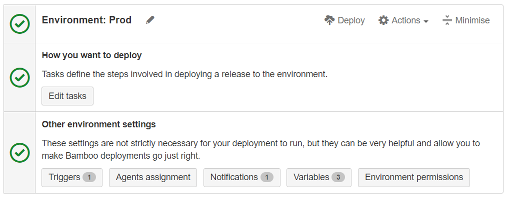

### Trigger

With a trigger configured as `After successful build plan` and the plan configured to be triggered with any commit in the repository we have basically configured a Continuous Delivery schema.  

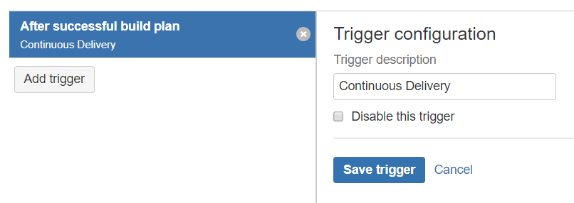

Remember that you can configure which repository and branch triggers a build then for example you can configure a Continuous Deployment schema for a Dev branch and a Continuous Delivery schema for the master branch.

### Variables

I have defined three different variables: host, password and username. For the web deployment script task. Remember that if the variable contains the word `password` Bamboo will automatically mask their content in the log files for example.

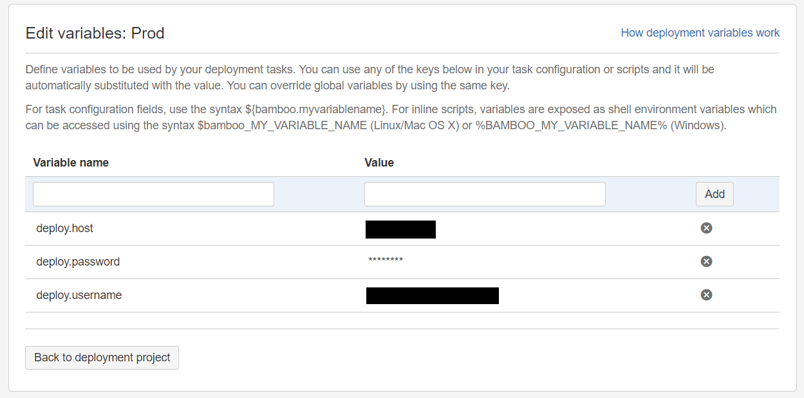

## Deploy

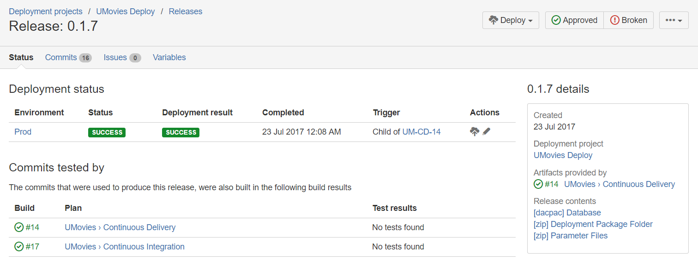

We can deploy the application at any moment, rollback version, etc.

That’s it, this blog post ended a little bit longer that expected but it describe all the steps and details to implement an effective Continuous Delivery/Deployment process for a .NET 4.5 Web application and a SQL Database using Web Deploy.
