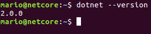
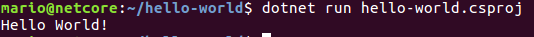
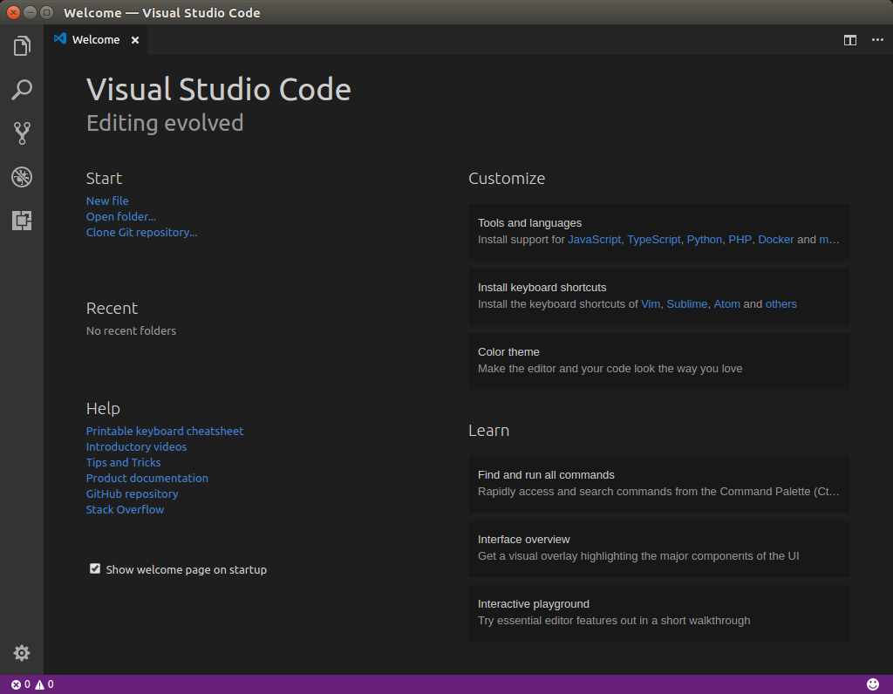
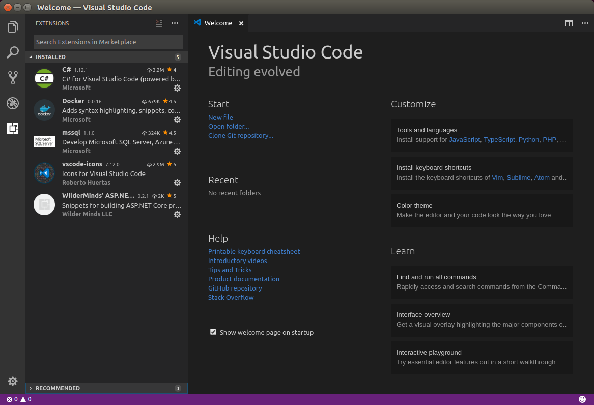

On this post I will describe the steps I have followed to go from an Ubuntu 16.04 clean installation to a .NET Core and Docker development environment. 

## Initial Setup

This step is definitely not mandatory. By default Ubuntu comes with different great applications. As this is intended to be a development environment I prefer to remove some of the non-development related applications. At least the biggest in size. For example:

	apt-get remove libreoffice-*
	apt-get remove thunderbird
	etc
	
## Git

My first step was to install Git: [https://git-scm.com/](https://git-scm.com/)

You can install it from the official repository. It is recommended to update your package catalog before continue:

	apt-get update

### Install Git

	apt-get install git

### Test your installation 

	git --version
	git version 2.7.4

### First time Git setup

At least you need to configure your user name and email. This is mandatory if you later want to make some commits: [https://git-scm.com/book/en/v2/Getting-Started-First-Time-Git-Setup](https://git-scm.com/book/en/v2/Getting-Started-First-Time-Git-Setup)

For example: 

	git config --global user.name "Jim Raynor"
	git config --global user.email jim.raynor@example.com

## NET Core

We can install .NET Core (2.0 at the moment of this writing) following the installation steps from the official documentation: [https://www.microsoft.com/net/core#linuxubuntu](https://www.microsoft.com/net/core#linuxubuntu)

### Install Curl

	apt-get install curl

### Register the Microsoft Product key as trusted

	curl https://packages.microsoft.com/keys/microsoft.asc | gpg --dearmor > microsoft.gpg
	sudo mv microsoft.gpg /etc/apt/trusted.gpg.d/microsoft.gpg

	sudo sh -c 'echo "deb [arch=amd64] https://packages.microsoft.com/repos/microsoft-ubuntu-xenial-prod xenial main" > /etc/apt/sources.list.d/dotnetdev.list'

### Update your package catalog

	sudo apt-get update

### Install .NET Core SDK
	
	sudo apt-get install dotnet-sdk-2.0.0

### Test Installation
	
	dotnet --version
	

Optional, you can create a sample application

	dotnet new console -o hello-world
	cd hello-world/
	dotnet run hello-world.csproj

## VSCode

I choose VSCode as my default .NET Core IDE. 

### Download .deb package

You can download the .deb install package from the official site: [https://code.visualstudio.com/Download?wt.mc_id=DotNet_Home&dotnetid=493278267.1503672714](https://code.visualstudio.com/Download?wt.mc_id=DotNet_Home&dotnetid=493278267.1503672714)

The latest version at the moment of this writing is VSCode 1.15.1.

### Install package

	sudo dpkg -i code_1.15.1-1502903936_amd64.deb

	
### Extensions

This is just a little list of the extensions I like to install first.

- C#: C# for Visual Studio Code (powered by OmniSharp)
- Docker: Add syntax highlighting, snippets, commands, hover tips, and linting for Dockerfile and docker-compose files
- mssql: Develop Microsoft SQL Server, Azure SQL Database and SQL Data Warehouse everywhere
- vscode-icons: Icons for Visual Studio Code
- WilderMinds' ASP.NET Core Snippets: Snippets for building ASP.NET Core projects in Visual Studio Code

## Docker

[https://www.docker.com/docker-ubuntu](https://www.docker.com/docker-ubuntu)

### Update the apt package index

	sudo apt-get update
	
### Install packages to allow apt to use a repository over HTTPS

	sudo apt-get install \
    		apt-transport-https \
    		ca-certificates \
    		curl \
    		software-properties-common

### Add Docker’s official GPG key

	curl -fsSL https://download.docker.com/linux/ubuntu/gpg | sudo apt-key add -

### Verify that the key fingerprint 

Verify that the key fingerprint is 9DC8 5822 9FC7 DD38 854A E2D8 8D81 803C 0EBF CD88

	sudo apt-key fingerprint 0EBFCD88
	pub   4096R/0EBFCD88 2017-02-22
	      Key fingerprint = 9DC8 5822 9FC7 DD38 854A  E2D8 8D81 803C 0EBF CD88
	uid                  Docker Release (CE deb) <docker@docker.com>
	sub   4096R/F273FCD8 2017-02-22

### Set up the stable repository

	sudo add-apt-repository \
   		"deb [arch=amd64] https://download.docker.com/linux/ubuntu \
   		$(lsb_release -cs) \
   		stable"

### Update the apt package index

	sudo apt-get update

### Install the latest version of Docker CE

	sudo apt-get install docker-ce

### Test Installation

	sudo docker run hello-world

### Run docker without sudo

I you want to avoid `sudo` in commands like `docker ps` add your user to the docker group 

	sudo usermod -aG docker [username]

This steps is optional, mostly for convenience, you can execute those commands using `sudo` at any moment. It's only mandatory if you are configuring a Continuous Integration server, where there is no option to interactively enter a password. 

### Erase hello-world container & image

Optionally you can erase the hello-world container & image

	docker ps -a
	CONTAINER ID        IMAGE               COMMAND             CREATED             STATUS                     PORTS               NAMES
	d00b13ddd4d4        hello-world         "/hello"            6 minutes ago       Exited (0) 6 minutes ago                       happy_ramanujan

	docker rm d00b13ddd4d4

	docker images
	REPOSITORY          TAG                 IMAGE ID            CREATED             SIZE
	hello-world         latest              1815c82652c0        2 months ago        1.84kB

	docker rmi 1815c82652c0

## Final Thoughts

That's it. Literally in a couple of minutes we have a complete development environment ready from a clean Ubuntu installation. You can clone a git repository, develop with VSCode and build and deploy .NET Core applications using Docker :)