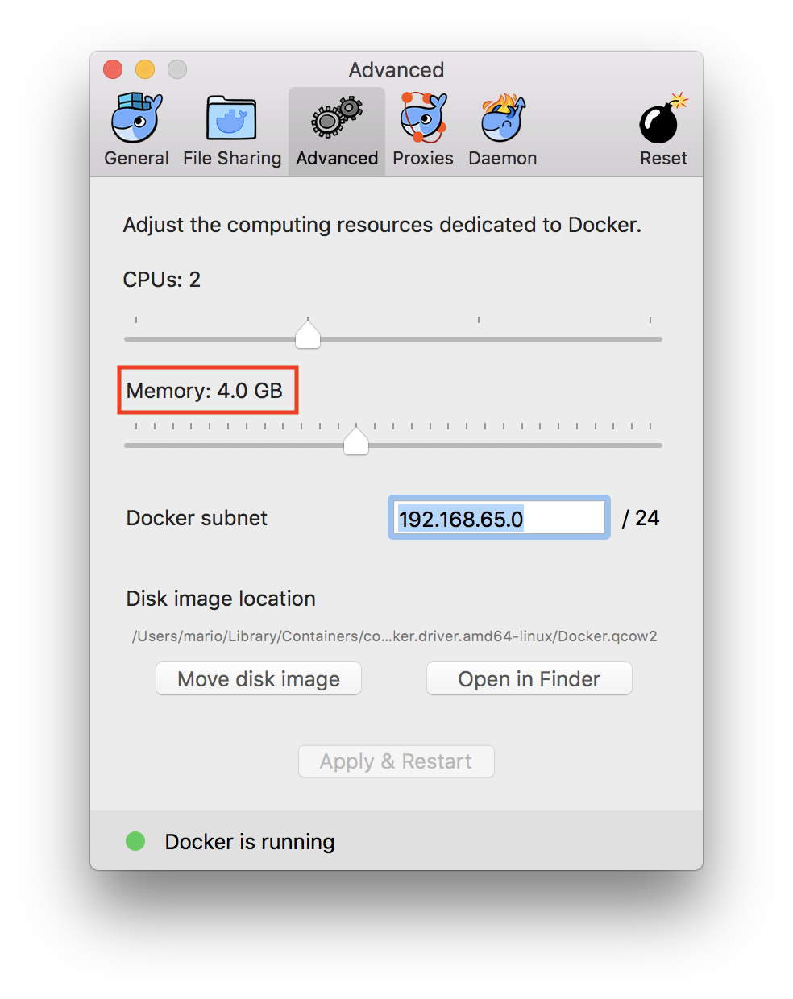
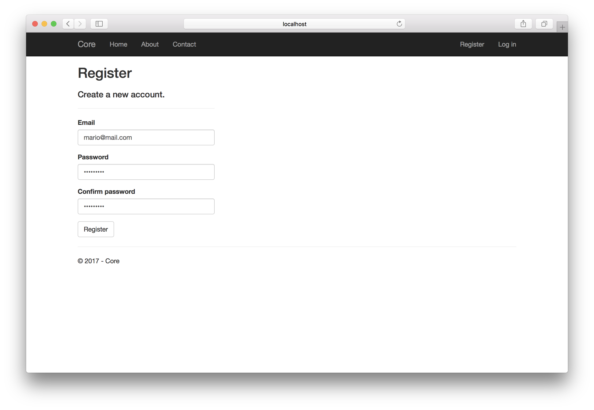
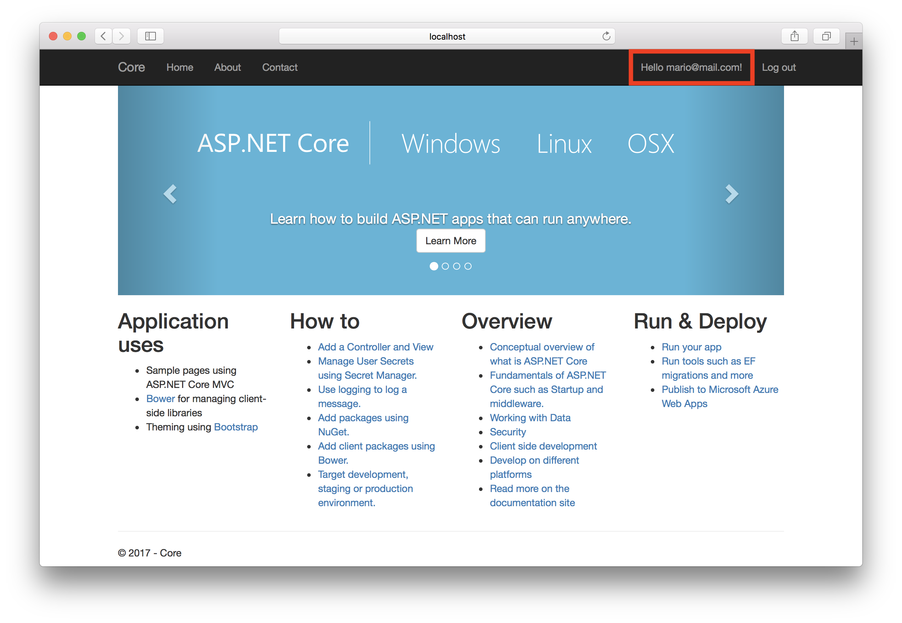

In this post I will explain all the steps I follow to create a default ASP .NET Core MVC application with Identity using MSSQL Server on Docker.

> I'm using a Mac but the same steps (maybe with some slightly differences in Windows) should be valid for Linux and Windows.

## Requirements

### .NET Core 

.NET Core installed, you can follow the steps from the official site: [https://www.microsoft.com/net/learn/get-started/macos](https://www.microsoft.com/net/learn/get-started/macos)

### Docker

Again you can follow the steps from the official site: [https://www.docker.com/docker-mac](https://www.docker.com/docker-mac)

Docker for MSSQL Server requires 4GB of memory. Currently the default is 2GB but you can easily change it in Docker from Mac from the docker logo in the top status bar and select Preferences.

## Create the MVC Application

From the terminal: 

    dotnet new sln -o Core.sln
    dotnet new mvc -o Core -uld --auth Individual
    dotnet sln add Core/Core.csproj

Quick explanation:

First create the solution file (optional, you can directly use a project file)  
Then create a MVC web application, the `-uld` option is to use SQL Server instead of the default option (I think it's SQL Lite) ant then the `--auth Individual` to use Individual identity accounts.  
The last step is to include the project in the solution file. 

## Docker

Based on the official documentation: [https://docs.microsoft.com/en-us/sql/linux/quickstart-install-connect-docker](https://docs.microsoft.com/en-us/sql/linux/quickstart-install-connect-docker)

First we need to get the SQL Server 2017 image:

    docker pull microsoft/mssql-server-linux:2017-latest

Then we can run the container:

    docker run -e 'ACCEPT_EULA=Y' -e 'MSSQL_SA_PASSWORD=<strong-password>' -p <local-port>:1433 --name <container-name> -d microsoft/mssql-server-linux:2017-latest

For example:

    docker run -e 'ACCEPT_EULA=Y' -e 'MSSQL_SA_PASSWORD=P@ss2017' -p 1433:1433 --name core-sql -d microsoft/mssql-server-linux:2017-latest

You can validate that the container is running by:

    docker ps

    CONTAINER ID        IMAGE                                      COMMAND                  CREATED             STATUS              PORTS                    NAMES
    279dcbb21e2b        microsoft/mssql-server-linux:2017-latest   "/bin/sh -c /opt/m..."   37 minutes ago      Up 37 minutes       0.0.0.0:1433->1433/tcp   core-sql

## Configure Connection String

After the container is running we are ready to configure the connection string in our application. First we need to know our ip by for example running:

    ifconfig

In my case `10.0.64.104`

Then you can modify the `appsettings.json` ConnectionStrings section in the project.

    "ConnectionStrings": {
        "DefaultConnection": "Server=10.0.64.104,1433;Database=CoreDev;User Id=sa;Password=<strong-password>;MultipleActiveResultSets=true"

## Update Database

We are almost ready. There is only one step left before we can run the application. Update our database and create all the neccesary tables. In order to do that we can run in the project directory:

    dotnet ef database update

After a couple of seconds our database should be created with all the necessary tables.

We can test this steps with docker and running sqlcmd (included in the image) to query the database and tables.

    docker exec -it core-sql "bash"
    /opt/mssql-tools/bin/sqlcmd -S localhost -U sa -P '<strong-password>'
    1> select Name from sys.Databases
    2> GO

As a result you should see all the databases, included our just created CoreDev database:

    master                                                                                                                          
    tempdb                                                                                                                          
    model                                                                                                                           
    msdb                                                                                                                            
    *CoreDev*    

We can also query for the tables inside our database:

    SELECT TABLE_NAME FROM CoreDev.INFORMATION_SCHEMA.TABLES WHERE TABLE_TYPE = 'BASE TABLE'

Result

    __EFMigrationsHistory                                                                                                           
    AspNetRoles                                                                                                                     
    AspNetUserTokens                                                                                                                
    AspNetUsers                                                                                                                     
    AspNetRoleClaims                                                                                                                
    AspNetUserClaims                                                                                                                
    AspNetUserLogins                                                                                                                
    AspNetUserRoles 

> Remember to include `GO` after every T-SQL query to execute it. And `Quit` to exit sqlcmd interactive mode.

    use CoreDev
    GO
    Changed database context to 'CoreDev'.

    select * from __EFMigrationsHistory
    GO
    MigrationId                                                                                                                                            ProductVersion                  
    ------------------------------------------------------------------------------------------------------------------------------------------------------ --------------------------------
    00000000000000_CreateIdentitySchema                                                                                                                    2.0.0-rtm-26452                 

## Run Application

We have installed and configured all the requirements to run our MVC default web application using identity with SQL Server 2017 in docker.

The only step left is basically run the application:

    dotnet run --project Core.csproj

Navigate to http://localhost:5000 and create our first account by clicking on Register.

Click on Register and we will be automatically redirected to our Home as the newly created user.

