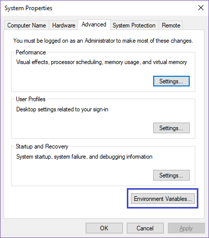
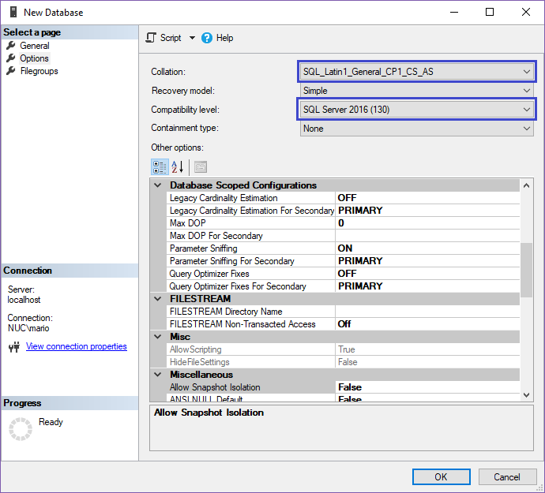

In this post I will explain all the steps I follow to install SonarQube in a Windows (Windows 10) environment. Windows Server steps should be the same except from resources location. You should surely connect to a remote database server, needs to configure remote access on that server. Also make the SonarQube server available outside (enable TCP port) etc. Most of the steps like configure it as a Windows service are explained in this post.

## Requirements

SonarQube needs two main requirements: Java and a supported Database. In my case I have a SQL Server Express 2017 (14.0.1000) instance. But no Java installed, so I will go first with the download and setup of Java and then create a database.

## Java Installation

At the moment of this write the latest version of SonarQube is 7.0 and it only supports Java 8. [https://docs.sonarqube.org/display/SONAR/Requirements](https://docs.sonarqube.org/display/SONAR/Requirements)

We can download the latest JDK from the official site [http://www.oracle.com/technetwork/java/javase/downloads/index.html](http://www.oracle.com/technetwork/java/javase/downloads/index.html) the current latest version is JDK 8u162.

The download file is a tar.gz with a `jdk1.8.0_162` folder inside. You can open and extract it with most compression tools like [7-zip](http://www.7-zip.org/).

Copy the extracted folder to a any folder in you hardrive, like: C:\, C:\Java, etc. Personally I don't like spaces in the path like "C:\Program Files\Java" but there is no restriction there.

Once you extracted the folder we have to configure some environment variables. In order to do that we need to open the System Properties Window. Control Panel > System and Security > System or just type `control system` in a console window.

Then go to Advanced system settings (another quick way, maybe the quickest way, is to type `sysdm.cpl` in a console window)

In the System Properties window go to the Advanced tab > Environment Variables button

Add the `JAVA_HOME` variable configured with the path to the JDK folder, for example: `C:\java\jdk1.8.0_162`. Also for convenience we can add the bin folder to the Windows PATH environment variable. Following our example: `C:\java\jdk1.8.0_162\bin` that will allow us to run java at any console window just by type `java`

Once we completed those steps we should be ready to test the installation. Open a console window cmd.exe or Windows key + I or A and type 

    java -version
    
we should something similar to the screenshot

Also we can test the `JAVA_HOME` environment variable by running

    echo %JAVA_HOME%

In a console Window (cmd.exe) or:

    $env:JAVA_HOME

In a powershell window

In both cases you should see the configured path.

## SQL Server Database

Assuming that you already have a SQL Server instance installed (which is my case) the only step left is to create the database and user.

First we will create the database. You can name it wherever you want, in my case `sonarqube` the minimum things that you need to take into account are the collation and compatibility level

The collation must be case-sensitive (CS) and accent-sensitive (AS) for example: `SQL_Latin1_General_CP1_CS_AS`

About the compatibility level, since I have installed an instance of SQL Server Express 2017 and the current version of SonarQube only supports SQL Server 2014 or 2016 I need to explicitly configure it with one of the supported versions.

The following steps are to create the user. This is not mandatory but recommended. In my case I have created a sonarqube user and map it to the sonarqube database and DB Owner.

From SQL Server Management Studio: Security > Logins > New Login and then on User Mappings you can setup the `db_owner` database role membership.

## Download SonarQube

With all the previous steps executed already we are ready to install SonarQube. First we have to download it from the official site: [https://www.sonarqube.org/#downloads](https://www.sonarqube.org/#downloads). At the moment of this write the latest version is 7.0.

The installation basically consist on the extraction of the `sonarqube-7.0` folder in a specific folder like: C:\sonarqube

After we extract the folder we have to configure SonarQube with our database connection string, user and password. 

In order to do that we have to edit the `sonar.properties` file [install_directory]/conf/sonar.properties 

Uncomment and Configure:

    sonar.jdbc.username=[sonarqube-db-user]
    sonar.jdbc.password=[sonarqube-db-password]

> In our example the db user is `sonarqube`

Also uncomment and configure the SQL Server Section

    sonar.jdbc.url=jdbc:sqlserver://[dbhost];databaseName=[sonar-db];instance=[instance-name]

> For example sonar.jdbc.url=jdbc:sqlserver://localhost;databaseName=sonarqube
> The instance is only required if you don't use the default SQL Server instance: MSSQLSERVER

## Configure to run as a Windows Service

This step is completely optional. You can always run SonarQube from any console window by running: 

    %SONARQUBE_HOME%/bin/windows-x86-[X]/StartSonar.bat

But if you want to configure it as a Windows service (recommended in a server installation). You can do it by opening a console window as an administrator and run: 

    %SONARQUBE_HOME%/bin/windows-x86-[X]/InstallNTService.bat

You should get and output similar to:

    wrapper  | SonarQube installed.

Then you can open the Services console (running `services.msc` from a console window for example) and validate that the SonarQube service is installed (and stopped at the moment)

Another optional step is to change the default service Log on account from Local System Account to a specific user account for SonarQube. This will allow for example to have more granularity at the file system access rights. But maybe have more sense when we are configuring SonarQube in a server.

> Another thing to take into account is in order to be able from SonarQube to connect to the DB server, TCP/IP and remote access needs to be enabled in SQL Server.

For external access you need to enable tcp port 9000 in your firewall.

## SonarQube

That's it. With all the previous steps executed you should be able to navigate to http://localhost:9000

And login to the application as an administrator with the default admin credentials:

User=admin  
Password=admin 

