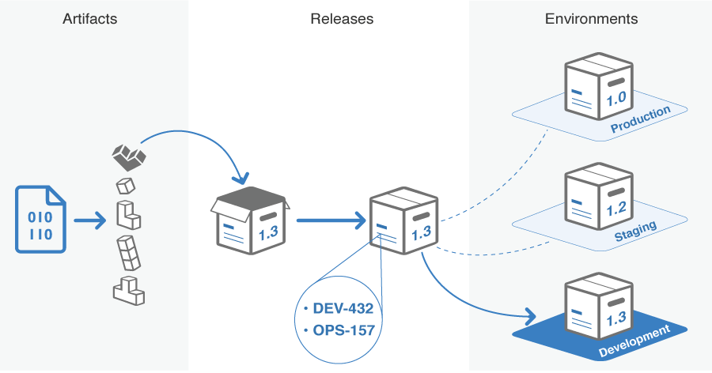
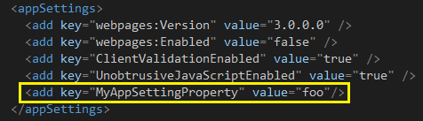
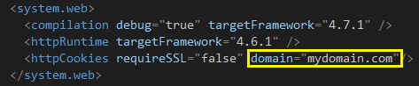
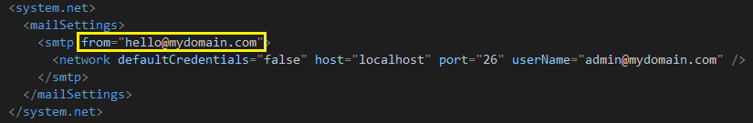
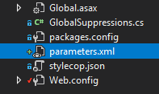
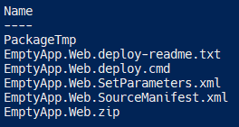
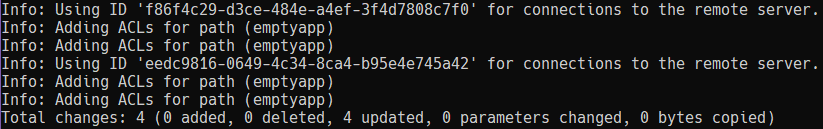

In this post I will explain the steps I follow to put in place a Continuous Delivery process for a .NET MVC Application. 

The proposed solution is based on WebDeploy and parameter files to generate one deployment package and deploy it to N environments. Something similar to the following picture.

> Image credits: [https://confluence.atlassian.com/bamboo/deployment-projects-338363438.html](https://confluence.atlassian.com/bamboo/deployment-projects-338363438.html)

The same process could be applied to WebForms and WebApi applications.

> Update: There is a [second part of this post](https://mamcer.github.io/2018-04-21-continuous-delivery-mvc-parameters-tfs/) in which I explain how to orchestrate this process in MS Team Foundation Server

## Web Application

First we need an ASP .NET web application to deploy :) In this case and for the purpose of this post, a simple ASP .NET MVC 5 application. You can download the code from: [https://github.com/mamcer/emptyapp](https://github.com/mamcer/emptyapp)

Again for the purpose of this post we will focus con three different configuration examples:

An appSettings variable

A httpCookieDomain attribute 

and a mailSettings attributes

This could be extended to any other value in the configuration file. All the configurations are in the Web.config file.

## Parameter Files

As a second step we will add a `parameters.xml` file in the solution

With the following content according to our previous example.

    <parameters>
      <parameter name="MyAppSettingProperty">
        <parameterEntry kind="XmlFile" scope="Web.config" match="/configuration/appSettings/add[@key='MyAppSettingProperty']/@value" />
      </parameter>
      <parameter name="HttpCookieDomain">
        <parameterEntry kind="XmlFile" scope="Web.config" match="/configuration/system.web/httpCookies/@domain" />
      </parameter>
      <parameter name="MailSettingsFrom">
        <parameterEntry kind="XmlFile" scope="Web.config" match="/configuration/system.net/mailSettings/smtp/@from" />
      </parameter>
    </parameters>

> To learn more about parameter files: [https://msdn.microsoft.com/en-us/library/ff398068(v=vs.110).aspx](https://msdn.microsoft.com/en-us/library/ff398068(v=vs.110).aspx)

## Generate Package

The next step is to generate an initial deployment package. Several ways to do that, one way is from a command line with MSBuild.

  MSBuild.exe EmptyApp.sln /p:Configuration=Release /p:DeployOnBuild=true /p:DeployTarget=Package /p:CreatePackageOnBuild=True

On `\Src\EmptyApp.Web\obj\Release\Package\` it will generate a deployable package of our application. In particular an inital `EmptyApp.Web.SetParameters.xml` file.

That file will be our template for every different environment

    <?xml version="1.0" encoding="utf-8"?>
    <parameters>
      <setParameter name="IIS Web Application Name" value="Default Web Site/EmptyApp.Web_deploy" />
      <setParameter name="MyAppSettingProperty" value="" />
      <setParameter name="HttpCookieDomain" value="" />
      <setParameter name="MailSettingsFrom" value="" />
      <setParameter name="EmptyApp-Web.config Connection String" value="Data Source=localhost;Initial Catalog=emptyapp;Integrated Security=true;MultipleActiveResultSets=True" />
    </parameters>

Copy the file to a different folder, you can define here if you want to include it or not in your source code repository. The important thing here is that we will have as many of them as environments we want to deploy. In fact we can name them according to the environment, for example: `Dev.Web.SetParameters.xml`, `QA.Web.SetParameters.xml`, `Staging.Web.SetParameters.xml`, etc.

## Configure Custom Parameters file

Using the file generated in the previous step as a template we will configure it with a environment specific configuration.

For example for a potential Dev environment:

    <?xml version="1.0" encoding="utf-8"?>
    <parameters>
      <setParameter name="IIS Web Application Name" value="emptyapp" />
      <setParameter name="EmptyApp-Web.config Connection String" value="Data Source=mydbserver;Initial Catalog=emptyapp;User ID=emptyapp;Password=Empty@pp;MultipleActiveResultSets=True" />
      <setParameter name="MyAppSettingProperty" value="dev-env" />
      <setParameter name="HttpCookieDomain" value=".devdomain.com" />
      <setParameter name="MailSettingsFrom" value="dev@mydomain.com" />
    </parameters>

Then we can run the cmd file generated in the previous step specifing the server we want to deploy and the correspondent Parameter file.

  .\EmptyApp.Web.deploy.cmd /Y /M:[server-ip] /U:[user-name] /P:[password] -allowUntrusted -setParamFile:[path-to-our-parameters-file]

For example:

  .\EmptyApp.Web.deploy.cmd /Y /M:10.0.64.7 /U:Administrator /P:P@ssword -allowUntrusted -setParamFile:Dev.Web.SetParameters.xml

After a few seconds the application should be deployed to the server and the Web.config should contains all the specific values of that environment configured in the parameter file.

## Final thoughts

With this approach we can for example remove the build configurations per environment which makes mandatory to generate as many deployment packages as environment you want to deploy a specific version. Then we can generate one package and deploy it to different environments where add a new environment basically consist on generate a new parameter file with the specific configurations of that environment.

On a next post we can review how to orchestate this process with a Continuous Integration tool.