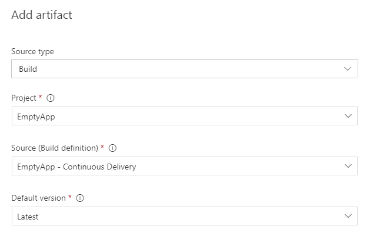

This is a continuation of my previous post [Continuous Delivery ASP .NET MVC Application](https://mamcer.github.com/)

I will explain step by step how to put in place the Continuous Delivery process explained in my previous post in a Continuous Integration & Delivery tool. In this case Microsoft Team Foundation Server.

## Create a build plan

Our first step is to create a Build Plan. This plan is responsible to generate the artifacts, a deployable version of our application.

In TFS you can create a new plan from Build and Release > New 

You have different template options to choose. In most cases I like to start with an empty process or import an existing configuration.

The final task configuration of our build plan should look like: 

In the next steps we will create every task. If you don't want to create the tasks one by one, you can download, import and use as an starting point at least the following json file. 

### Basic configuration

With basic configuration I refer to configuration like the name of the plan. It could be "[project-name] - Continuous Delivery" in this case but there is no rule here, you can name it as you want.

Another basic configuration is the repository and the specific branch, in my case master.

And as the last of these basic (common) configurations we can mention the Nuget restore task:

### Build Solution

The next task is responsible to generate the deployment package of our application. As we are working with an ASP .NET MVC application it's a MSBuild task.

Basically the same MSBuild command explained in my previous post but as a TFS build task. Here are the parameters in a copy friendly text format:

    /m /p:Configuration=Release /p:DeployOnBuild=true /p:DeployTarget=Package /p:CreatePackageOnBuild=True

This will generate a WebDeploy ready to deploy version of the application. In our case in the path `\Src\EmptyApp.Web\obj\Release\Package\`

### Copy Artifacts

The next task consist on the copy of the files generated in the previous step.

In TFS we can add a Copy File task with the following configuration:

It consists on the deployment (zip) package, a cmd file to deploy the application using WebDeploy and a SetParameters file with the specific configuration of an environment.

The task moves all the files to a common location ready to be published.

### Publish Artifacts

The last step in our plan consist on the publish of all our artifacts, making them available to future tasks. Releases in our case.

In order to do that you can add a Publish Build Artifacts task.

> A release projects refer to this artifacts by name: `web-deployment-package` you can define more than one artifact in the same build plan. For example one for the web application and another to a .dacpac database project release.

## Release 

In the previous steps we have created a deployable version of our application and put it in a convenient WebDeploy package.

A Release take that package as an input and deploy it to N environments. With different conditions, for example we can configure to deploy to an environment as soon as the package is available (Dev) or require a manual, explicit action to deploy it (QA for example).

In our case this is how it looks our final pipeline. 

### Artifacts 

As part of the artifact configuration we have to define the Build definition source, `EmptyApp - Continuous Delivery` in our case.

This will define which artifacts are available for the environments.

### Environments

You can define any amount of environments: Dev, QA, Staging, Prod for example. To the purpose of this post we only have one: Dev.

The task definition for our environment consist on just  one task. A TFS Batch Script task that executes the WebDeploy cmd file generated in the Build Plan with the appropiate parameters. 

Path:

    $(System.DefaultWorkingDirectory)/EmptyApp - Continuous Delivery/web-deployment-package/Src/EmptyApp.Web/obj/Release/Package/EmptyApp.Web.deploy.cmd

Arguments:

    /Y /M:[server-ip] /U:[user-name] /P:[password] -allowUntrusted -setParamFile:[environment-specific-parameters-file-path]

## Triggers

In order to have a Continuous Delivery process we need to configure the build and release triggers accordingly.  A continuous delivery schema requires that any change pushed to the repository should trigger a deploy. In order to that we have to configure the Trigger of the Build plan and of the specific Release environment.

Build

Release

## Final thoughts

Team Foundation Server even in their free Express version (all the above examples are based on an Express instance) is a powerful tool to orchestate a Continuous Integration and Delivery process. 

In this post I have explained how put in practice the commands and command line tools explained in my previous post to implement a Continuous Delivery process of an ASP .NET MVC application in TFS.
