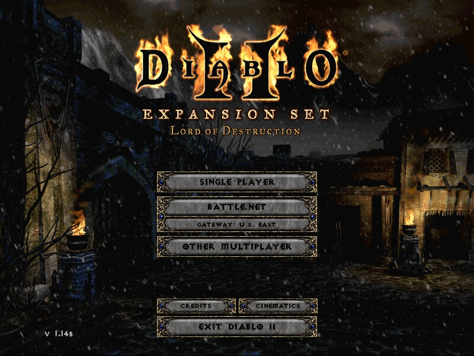

Diablo 2 is by far the game that I most played in my life.

I first played it in 2002 and since then (sometimes with years of difference) I played uncountable hours. Initially with a sorceress then paladin, assassin and necromancer.

I played with my wife (long time ago), all night with friends through Lan (also long time ago), over the internet in battle.net and finished it several times through the years in normal and nightmare difficulty solo games. Different characters, sometimes with the same class. But for some reason I have never played enough with one character to finish the game in hell difficulty.

So basically I decided to do that. Play the game through all the difficulties, no cheating, no downloaded items from the Internet. Just the character and whatever loot I can find in my journey. 

The choice of the class was easy: necromancer. Since several years ago it is my first choice followed by the paladin.

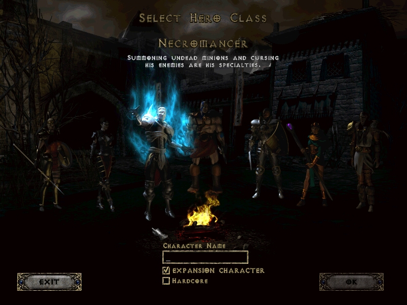

Normal difficulty was like a walk, in several ways also nightmare difficulty. It seems years of playing experience aren´t for nothing. Even keeping stat point unassigned (with no specific reason other that I didn't seem to need them) at some point I had 115 stat point unassigned. That is 23 character levels. 

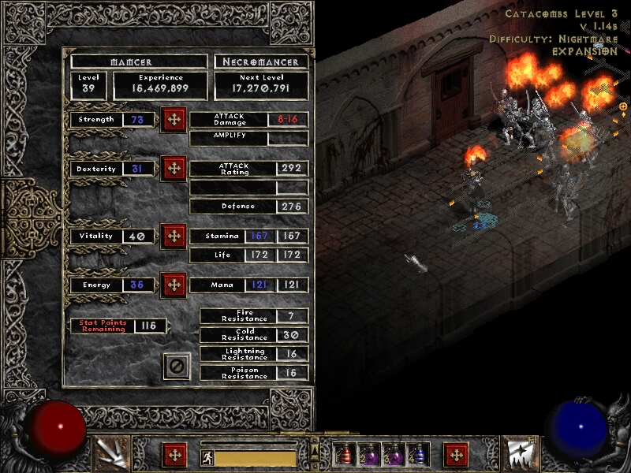

That was not the case of  the skills, I knew exactly where to assign each skill point. At the end of the post you can see my final stats and also my final equipment. Spoiler alert: nothing fancy there. 

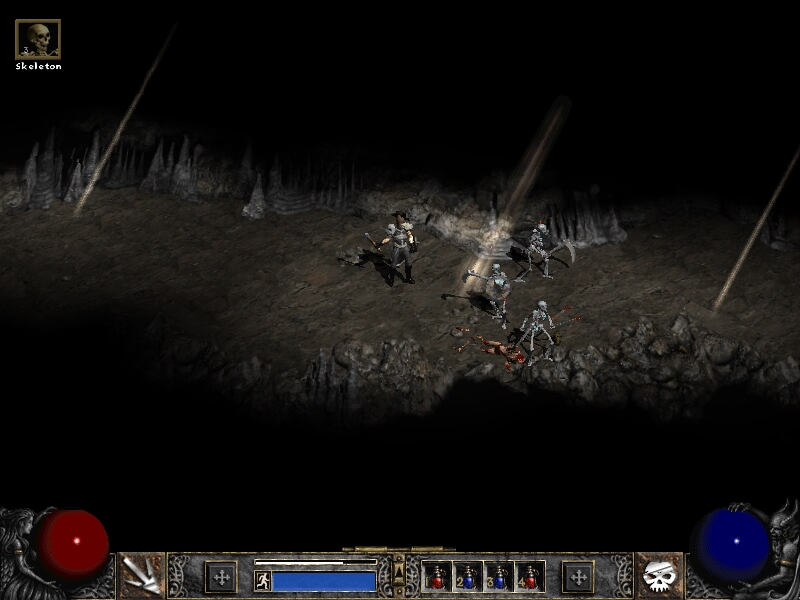

Hell difficulty was the most interesting and real challenge. Without quality items it seems that even the most insignificant foe can kill me and the experience penalty when you die is something to take into account. Act I was relatively easy, Act II was a challenge to get to Duriel  (specially the Arcane Sanctuary area) I really enjoy Act III and IV except from the Council Members and [Black Souls](http://classic.battle.net/diablo2exp/monsters/act5g-willowisp.shtml) I really hate those guys and their electric damage. Act V were difficult, especially the first open areas, the ancients and Baal minions. 

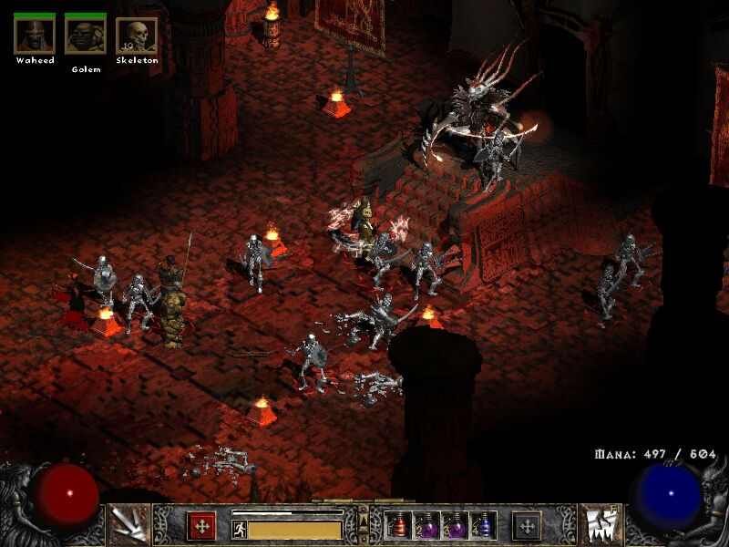

### Skills 

My character is basically a summoner necromancer. Initial point in Amplify Damage, complete Skeleton Warriors, complete Skeleton Mastery. At that time my character was acting mostly as a melee character with Bone armor and Corpse explosion to finish a group of enemies. Then the lack of resistances, defense and damage start to be very noticeable. You can focus on Bone Spirit, Bone Spear (synergies) and upgrade Amplify Damage to Decrepify.

#### Summoning Spells

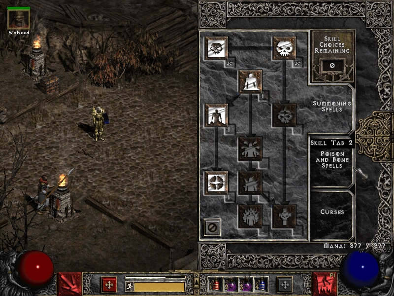

#### Poison and Bone Spells

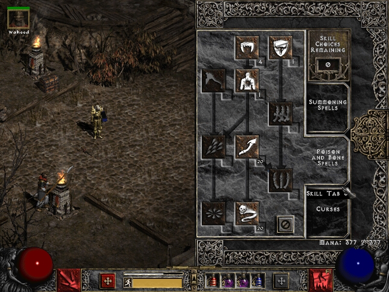

#### Curses

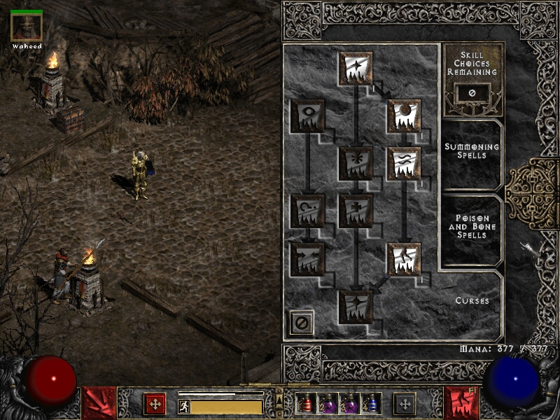

### Strategy

The skeletons do noticeable damage maybe until nightmare difficulty. Then they do an excellent job as tank receiving most of the damage. The act 2 mercenary helps with his aura and damage. The necromancer with bone spirits focus fire and after the first enemy dies leave corpse explosion cascade effect to take care of the rest of the monsters. Summon any slain skeleton, loot and repeat. 

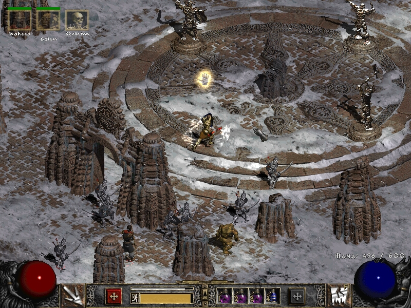

### Equipment

Nothing fancy here. Even since middle nightmare difficulty I started to focus on magic find it seems I didn’t have enough luck. I found a couple of interesting items but it could had been a lot better. I didn't found homunculus for example :( I really like the necromancer shrunken heads.
All my final items were a collection of normal, exceptional and a couple of unique. I have only found the [Trang-Oul's Claws](http://classic.battle.net/diablo2exp/items/sets/sets7.shtml#trangouls), the wand was bought in act 2 nightmare difficulty because of the bonus in my skills.

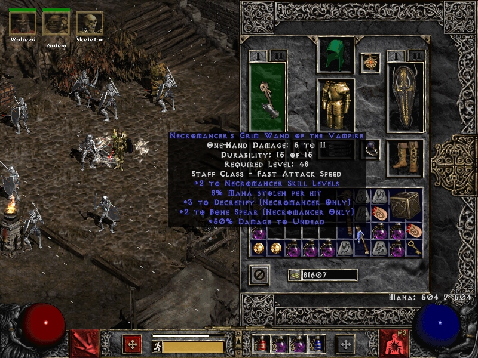

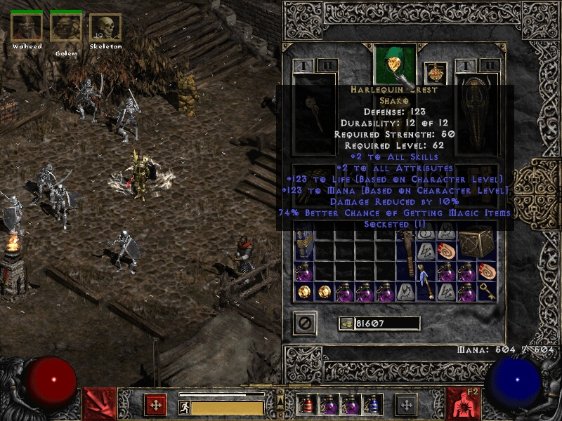

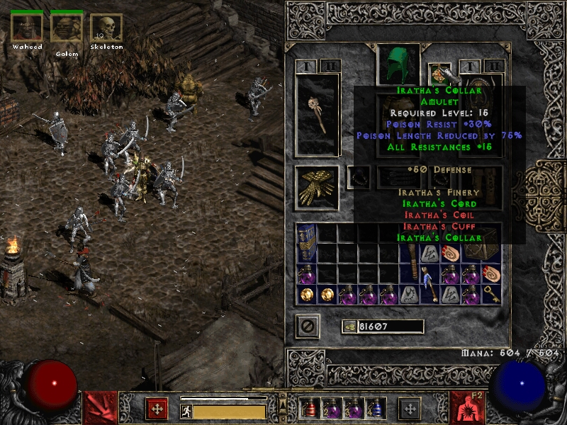

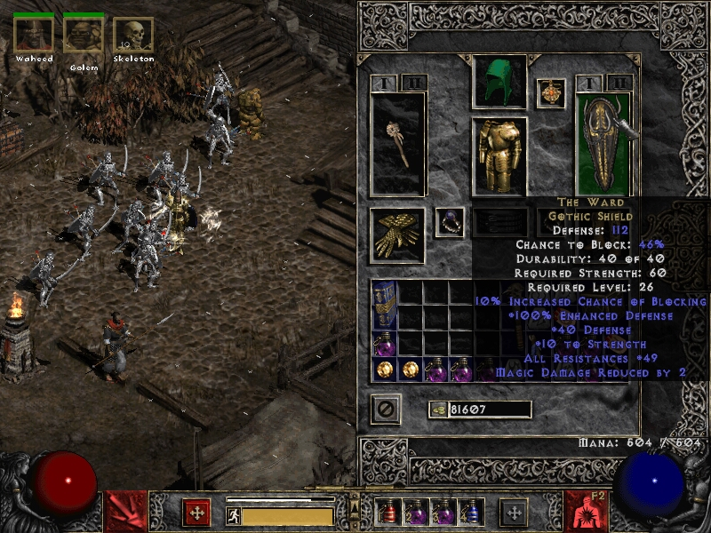

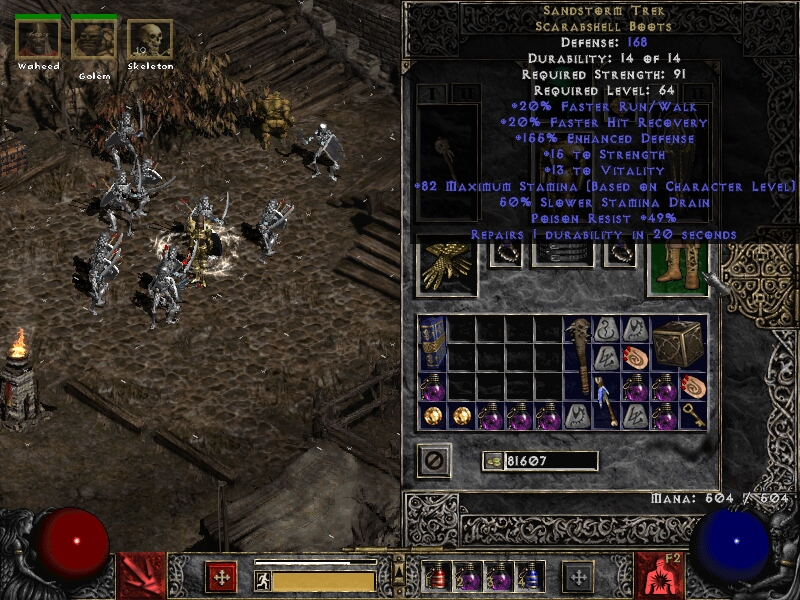

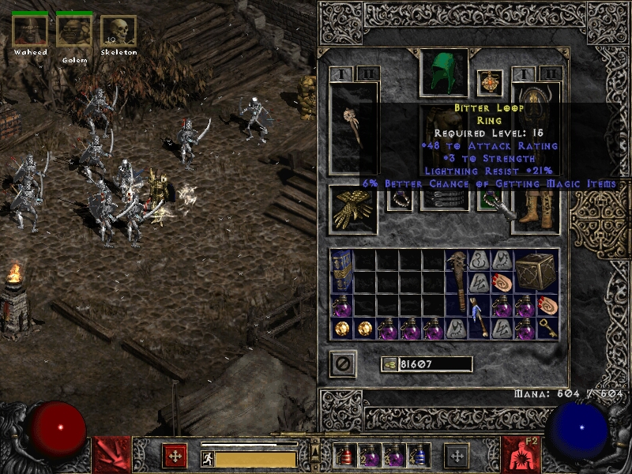

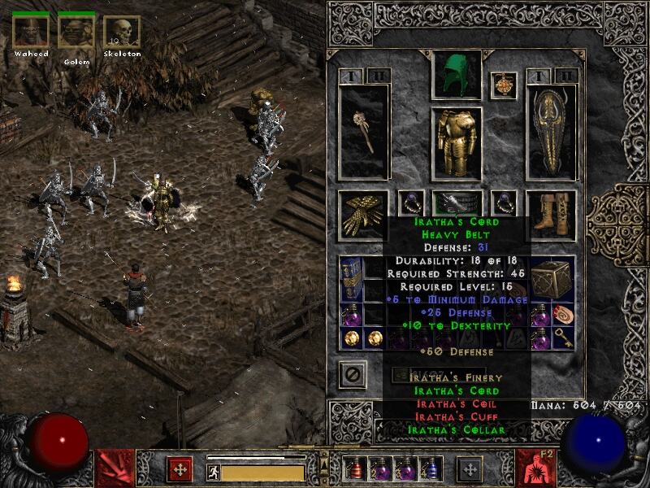

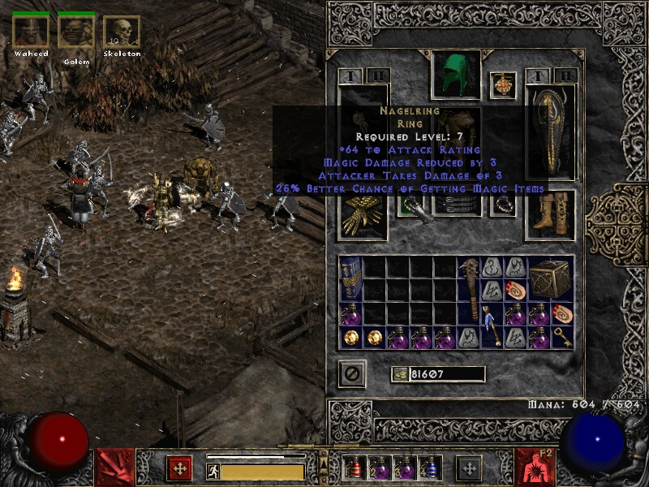

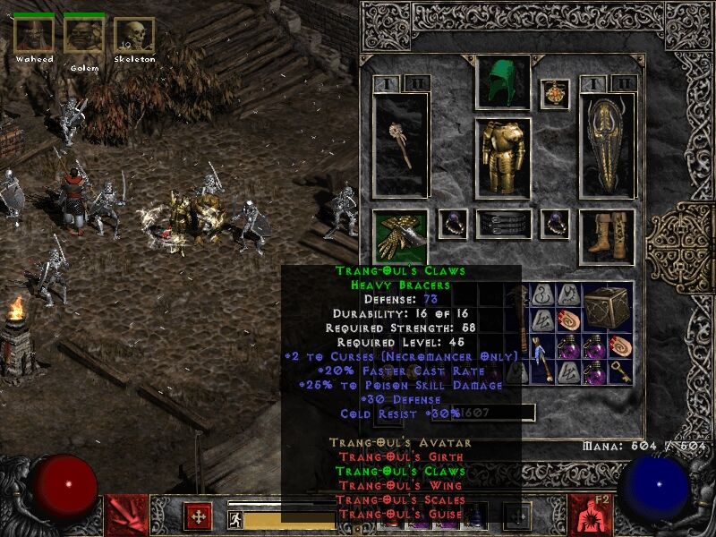

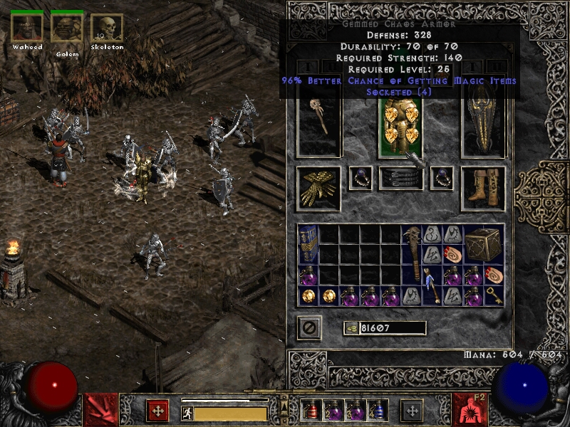

It happens to be that I mostly end up writing tutorial or step by step blog posts. Hoping to help someone with a specific topic. I doubt this post will help you, unless you are interested in a summoner necromancer Diablo 2 build. To me it was fun, nostalgic and also in a several ways, a way to close a long stage in my life.

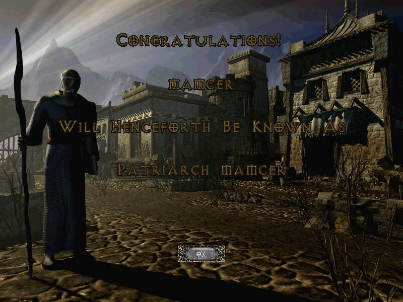