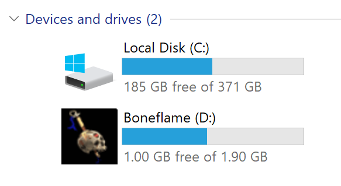
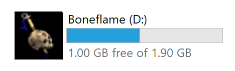
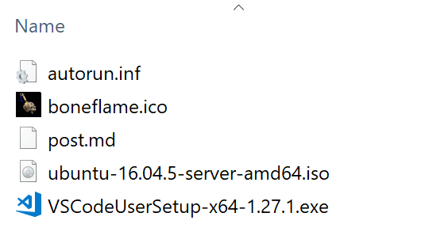

Several years ago I used to have have three removable drives in use. Two external disks for information backup, three replicas (inspired in MongoDB replication schema) and one flash drive for quick information sharing.

At that time I decided that it would be a good idea to name them with some *fancy* names. After a quick thinking (and as a Diablo 2 fan) there was no other option than the three unique Necromancer shrunken head items:

**Homunculus**

**Darkforce**

**Boneflame**

> Images from [http://classic.battle.net/diablo2exp/items/normal/unecromancer.shtml](http://classic.battle.net/diablo2exp/items/normal/unecromancer.shtml)

But changing the name was not enough. It would be great if I can also change the icon and name in Windows File Explorer.

Yesterday I found an old 2GB flash drive in a box. I connected to a laptop to see it's content and.. 

Boneflame appears :)

## How to configure a custom name and icon

I remember doing this burning CDs and basically the process is the same. You just need an `autorun.inf` file and an icon.

First create an autorun.inf file in the root folder of the flash drive. You can do it even with notepad. The content of the file should at least be:

    [AutoRun]
    ICON=[icon-file-name].ico
    LABEL=[name]

As a recommended additional step you can make autorun.inf and your icon file read-only.

Safely remove your drive and then the next and following times you connect it to your computer you will see the name and icon in File Explorer.

