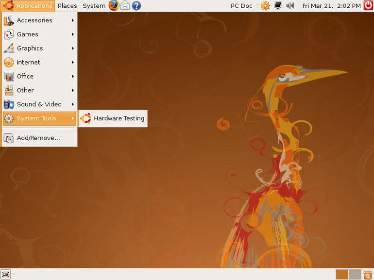

Ten years ago, well, in fact I’m talking about 2008 so this should had be written last year.

In 2008, I was in the second year working for a small company in Buenos Aires. It was my first professional full .NET job.

My daily work involved Visual Studio for coding, Team Foundation Server as source control and issue tracker and deploying applications in a semi automatic way, sometimes involving remote desktop a server to troubleshoot a problem. All over Microsoft Windows platform.

At that moment I had a coworker who was very in the open source and Linux world, Ubuntu in particular. In some ways he was trying to evangelize us from the Windows ‘monopoly’. I remember to have some funny discussions, he talking about Ubuntu and I trying to sell the ‘benefits’ of Windows.

I saw Linux with fascination as a mature solid platform focused on efficiency. Compared to a retro compatible focused platform with layers and layers added trying to satisfy with the same product to power and beginner users.

Ubuntu 08.04 Hardy Heron was the latest version. At that time I bought my first laptop and almost installed it in a weekend (side by side with my Windows Vista instance of course).

[image source](https://www.techrepublic.com/pictures/ubuntu-804-hardy-heron-features/9/)

My first, non VM linux, came two years later with Ubuntu 10.04 Lucid Lynx.

I choose .NET as my main technology around 2004. Before that I was working with C++, JAVA and Ruby, all multi platforms technologies. I didn’t remember exactly why I choose it, I think it was because I found the opportunity to take some free courses, there was work demand and .NET just worked in my humble desktop computer compared to some bad performance experiences with JAVA IDEs.

Ten years later I’m writing this from my personal Linux laptop. I’m still working in a legacy full framework project: Visual Studio, TFS, Windows Servers. But all my new and side projects are based on .NET Core, Docker and different multi platform technologies.

Open source has changed the world. It is a good time to be a developer, with so many multi platform, open, free and yet powerful options to choose. Lowering the barrier compared to just ten years ago.
