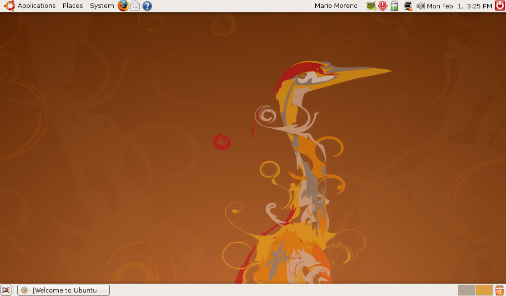
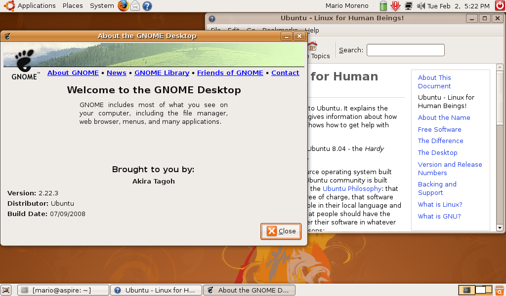
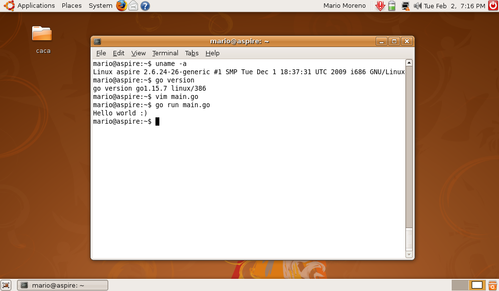

Back in 2008 I was a fulltime senior .NET developer. .NET Framework 3.5 was recently released, Visual Studio 2008, TFS 2008, SQL Server 2008, Silverlight, Windows Vista.. I was fully commited to .NET and all Microsoft related technologies and products

Also by that time I was able to bought my first laptop. My choice was a HP Pavilion TX which ended being more beautiful than powerfull but it was mine to try and investigate new technologies

Also back in that time I had a coworker fully commited to open source and open technologies. I remember to see some official Ubuntu install CDs in the office. He requested them and then promote and share. The latest and greatest version by that time was Ubuntu 08.04 LTS 'Hardy  Heron' he showed me a little demo on his own laptop. It was maybe my first glimpse over Ubuntu

I had the opportunity to work with Linux on 2005 when working on Ruby applications. I saw Linux as things done rigth, rock solid technology, for power users, people that knows what are they doing. Part of me wanted to be one of them, but none of my tools or developer technologies worked on that platform. In any case I almost promised him to give it a try and install side by side with my Windows Vista main installation over the weekend

I never kept that promise, at least not until now

On january 2021 I ended up being an owner of an Aspire One netbook with 1GB of RAM and an Intel Atom N270 processor. A dated obsolete Windows 7 installation that worked far below acceptable was screaming for a change. I tried Ubuntu 1604 and Debian 9 with XFCE. None of them were the best experience on such limited hardware, specially from memory consumption

Then I remembered my 'promise' and looked for a Hardy Heron installation image

Wifi was not recognized worked only Ethernet but apart from that I had an Ubuntu 0804 installation that 'felt' and worked very good on the hardware

My first real commitment to Linux was in 2010 with Lucid Lynx, still as a .NET developer but since then playing and trying different technologies and workflows until some years ago when I choose it as my development platform. My current professional work is done in a MacBook Pro: Golang and different technologies. It is fun to play on a (Today) very limited computer, almost everything in a terminal basically. For example I'm writing this post on the same computer but with LUbuntu 1804

As an extra, Golang worked 

12 years later but no one can say that I do not keep my promises, well at least not over this one :)

