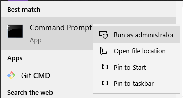
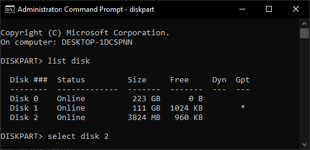
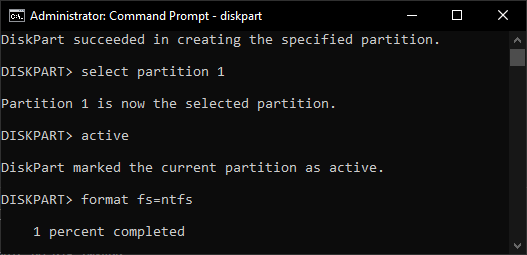
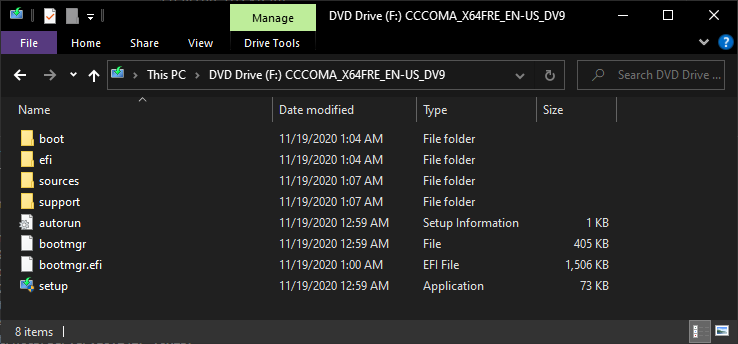
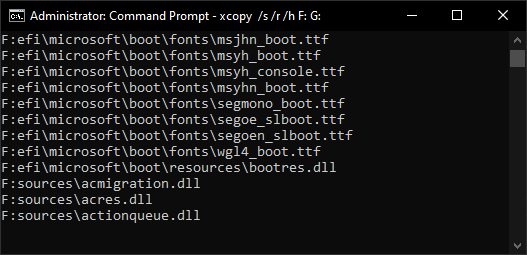

I was reviewing several old directories and I found different Windows recipes and scripts that I used often some time ago

Basically the following are the steps to create a Windows booteable disk from command line

What you will need: a flash drive (back in my time with 4GB was more than enough but I can see that current Windows 10 ISO is almost 6GB) and a Windows ISO file

## cmd as Administrator

Open cmd.exe as Administrator. Windows menu, search for cmd right click > Run as administrator

or instead of right click: ctrl-shift-enter

## Diskpart

Run Diskpart

List disk will show all your disks. Select the flash drive unit, in my case 'Disk 2'

All commands:

    DISKPART

    LIST DISK
    SELECT DISK X
    CLEAN
    CREATE PARTITION PRIMARY
    SELECT PARTITION 1
    ACTIVE
    FORMAT FS=NTFS
    ASSIGN
    EXIT

> All steps are almost immediate except `format` that will surely take some minutes

## Windows ISO

[https://www.microsoft.com/en-us/software-download/windows10ISO](https://www.microsoft.com/en-us/software-download/windows10ISO)

Remember that you can play with the developer tools, network conditions, user-agent to donwload the ISO file directly instead of the Windows 10 Upgrade tool

In recent versions of Windows mount an iso file is as easy as double click the file and it will appear as another unit. No mandatory need of tools like  

## Copy files

You can simply select all files in File Explorer, copy and paste in the flash drive or among other options to copy files you can use the old xcopy

    xcopy /s /r /h F: G:

or robocopy 

    robocopy /e F: G:

And that is all, you should be able to boot from this flashdrive and install Windows
