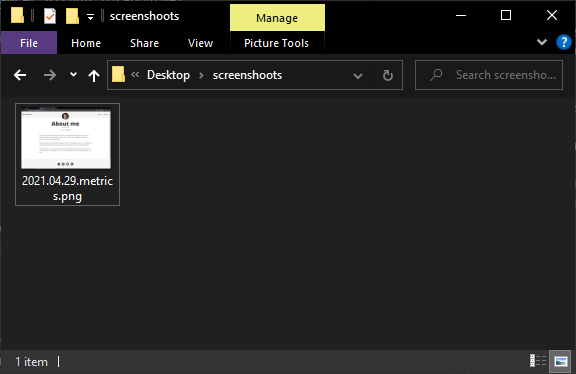

Continuing with the series of old MS Windows stories I found a shell script that I used as a base for several scripts mainly to automatize CI/CD tasks

This script was made from reviewing other coworkers scripts and example scripts from the Internet

    echo off
    SETLOCAL
    
    @REM  ----------------------------------------------------------------------------
    @REM
    @REM  author: [email]
    @REM
    @REM  ----------------------------------------------------------------------------
    
    echo.
    echo =========================================================
    echo   [script_name]]
    echo =========================================================
    echo.
    
    @REM set local variables
    set start_time=%time%
    
    @REM  ------------------------------------------------
    @REM  Shorten the command prompt for making the output
    @REM  easier to read.
    @REM  ------------------------------------------------
    set savedPrompt=%prompt%
    set prompt=$$$g$s
    
    rem do stuff
    
    pushd %CD%
    @if %ERRORLEVEL% NEQ 0 GOTO Error
    
    echo process successfully finished.
    GOTO End
    
    :Error
    echo an error has ocurred. 
    
    :End
    echo start time: %start_time%
    echo end time: %time%
    pause
    
    :finish
    popd
    set prompt=%savedPrompt%
    
    ENDLOCAL
    echo on

As an example here is a poor man's way to generate a daily metric report from a Silverlight report application (that old)

The application didn't support any report functionality, I didn't have access to it is database then as a quick solution I created this script and with some irfan_view help and a Windows scheduled task I was able to automatically open the application and take a daily screenshot of the metrics results

    echo off

    echo metrics screenshot script
    echo -------------------------

    set start_time=%time%
    set current_dir=%cd%
    set ie_path=C:\Program Files\Mozilla Firefox\firefox.exe
    set metrics_site=https://mamcer.github.io/aboutme/
    set irfanview_path=C:\root\bin\irfan-view\App\IrfanView\i_view32.exe
    set screenshot_path=C:\Users\mario\Desktop\screenshoots
    set wait_seconds=5

    echo open metrics site
    "%ie_path%" %metrics_site%

    echo wait some seconds for metrics site to load
    ping -n %wait_seconds% 127.0.0.1 > NUL 2>&1

    echo take a screenshot
    "%irfanview_path%" /capture=2 /convert="%screenshot_path%\$U(%%Y.%%m.%%d).metrics.png"
    @if %ERRORLEVEL% NEQ 0 pause

    cd %current_dir%

    echo ----------------------------- 
    echo process successfully finished.
    echo start time: %start_time%
    echo end time: %Time%
    pause

    echo on

