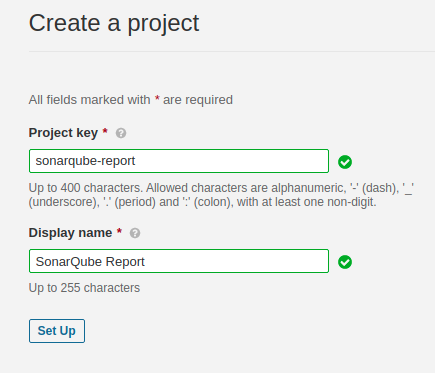
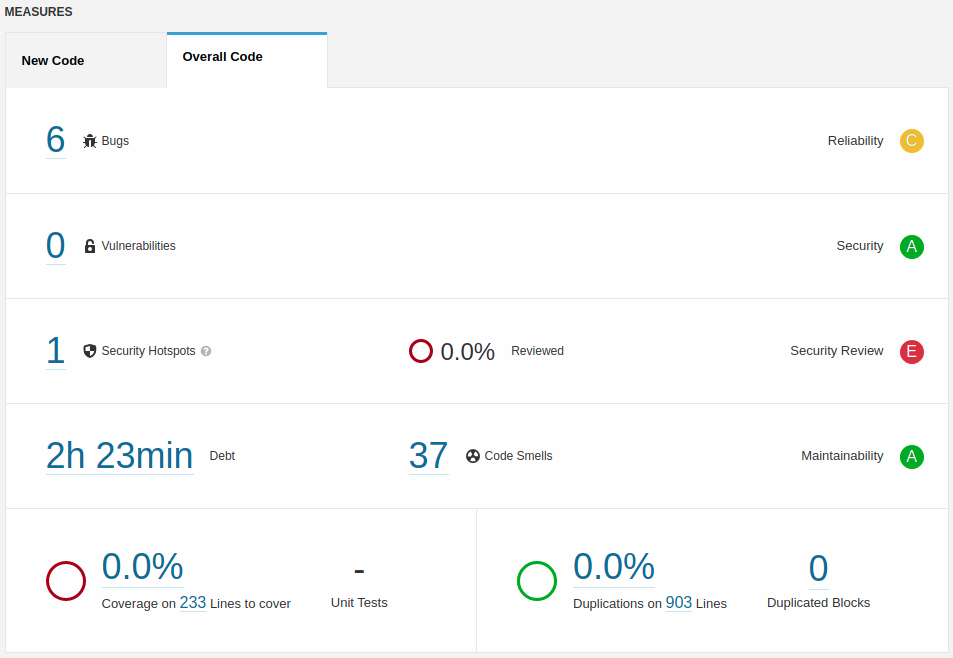
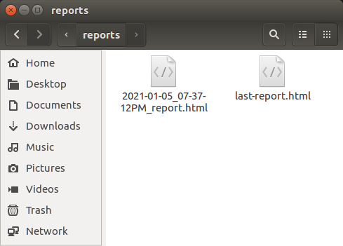
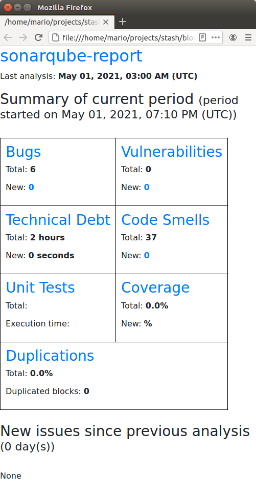

In this short blog post I want to present a [little application](https://github.com/mamcer/sonarqube-report) I made around three years ago. At that moment I was working on a small team developing a .NET full framework application and we used SonarQube to measure technical metrics. You can always explicitly navigate to the project dashboard but I wanted to have a daily summary in my inbox. The version of SonarQube that we had didn't support that functionality so based on a previous full .NET framework application were I was playing with the SonarQube server rest API I built this little .NET Core application to get SonarQube metric email reports in my inbox

## SonarQube

First of all we will need a SonarQube instance, you can install it directly and configure to use a separated DB server (I did that for different projects in the past) but for the purpose of this test or even small projects we can use the sonarqube docker image almost with the default configuration

    docker pull sonarqube

    docker run -d --name [name] -p 9000:9000 sonarqube

> Remember that the default admin credentials are: admin/admin

After that you will need to create a project and define e project key: `sonarqube-report` in this case. You will get access to the project token, we will need it to run our analysis later

## SonarQube Scanner

> In this case we will use the .NET Core SonarScanner (we will be analyzing the same application code) but there are [SonarScanner](https://docs.sonarqube.org/latest/analysis/scan/sonarscanner/) support for different technologies and platforms

Install the scanner

    dotnet tool install --global dotnet-sonarscanner

You should get a message similar to:

    You can invoke the tool using the following command: dotnet-sonarscanner
    Tool 'dotnet-sonarscanner' (version '5.2.1') was successfully installed.

The steps to run an analysis are well documented on the same SonarQube application

    dotnet sonarscanner begin /k:"[project-key]" /d:sonar.host.url="[sonarqube-instance-url]"  /d:sonar.login="[sonarqube-application-token]"

Then build the application

    dotnet build

And then collect and send the results to our SonarQube instance

    dotnet sonarscanner end /d:sonar.login="[sonarqube-application-token]"

    INFO: Analysis total time: 1:05.366 s
    INFO: ------------------------------------------------------------------------
    INFO: EXECUTION SUCCESS
    INFO: ------------------------------------------------------------------------
    INFO: Total time: 1:06.136s
    INFO: Final Memory: 16M/296M
    INFO: ------------------------------------------------------------------------
    The SonarScanner CLI has finished
    16:22:13.408  Post-processing succeeded.

After that you should be able to see the analysis results in SonarQube

## SonarQube.Report

The only thing left if to run our application. In the `appsettings.json` file there are several configuration keys to define like credentials. You can see an quick explanation of every key in the Readme file of the project [repository](git@github.com:mamcer/sonarqube-report.git)

To run the application:

    ./SonarQube.Report _ /noemail

the `/noemail` parameter tells the application to just leave the html report in a directory instead of also sending it by email

In the reports directory you should find at least two files, one with the date and time of the execution and one special file `last-report.html` with a copy of the last report execution to make it easier to identify and send by email

The html report file in the directory or received by email should look like the screenshot. With links to sections and specific filtered results in SonarQube

I recently found this project on a private repository, did some cleanup to share it. This application is almost three years old, the original development which this is based is even older. It still works but it for example targets `netstandard2.0` not even 3.0 (the current latest is net5.0). Hope someone find this interesting or even better: useful
