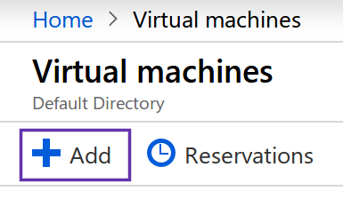
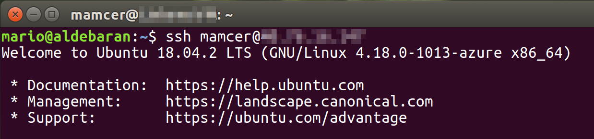
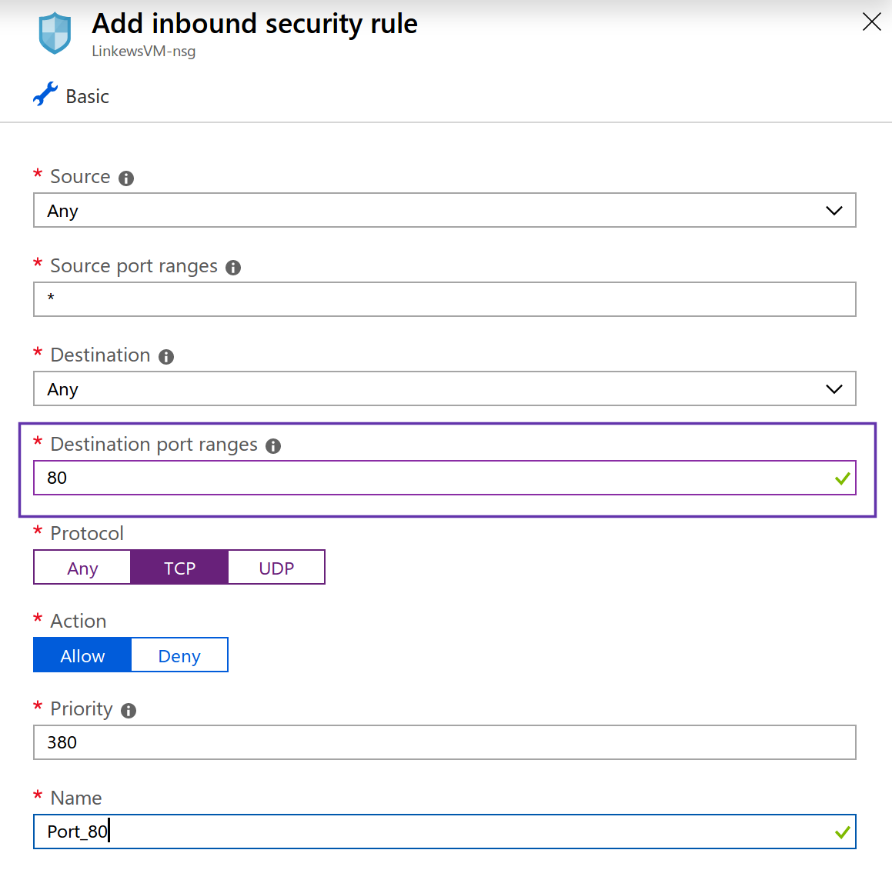

Well, continuing with the series of post years in draft.. this is from 2018/2019. How to provision, setup and publish a .Net Core development server (Ubuntu 1804) in Azure

## VM Provision

In this example I'm using Azure but the same steps could be applied to any Ubuntu 1804 server

We will skip some steps here Home > Virtual Machines > Add 

In this case I have created a Standard B2s (2 vcpus, 4 GB memory)

The steps to create a VM are very straighforward. Please make sure to set your public ssh key. It will be our way to connect to the server

## SSH

After Azure finishes provisioning the VM we can have access to the public IP address and then stablish our first ssh connection to the server

    ssh [user]@[public-ip]

## Set Timezone

Maybe for most configurations this isn't neccesary but I wanted the server be configured in my same timezone (Buenos Aires, Argentina)

    sudo timedatectl set-timezone America/Buenos_Aires

## DB 

[image source](https://www.techrepublic.com/pictures/ubuntu-804-hardy-heron-features/9/)
https://docs.docker.com/install/linux/docker-ce/ubuntu/

    sudo apt-get update

    sudo apt-get install \
       apt-transport-https \
       ca-certificates \
       curl \
       gnupg-agent \
       software-properties-common

    curl -fsSL https://download.docker.com/linux/ubuntu/gpg | sudo apt-key add -

    sudo add-apt-repository \
      "deb [arch=amd64] https://download.docker.com/linux/ubuntu \
      $(lsb_release -cs) \
      stable"

    sudo apt-get update

    sudo apt-get install docker-ce docker-ce-cli containerd.io

### Docker without sudo

    sudo groupadd docker
    sudo gpasswd -a $USER docker
    newgrp docker

### Initialize Database

    docker run -e 'ACCEPT_EULA=Y' -e 'SA_PASSWORD=[password]' -p 1433:1433 -d --name [container-name] microsoft/mssql-server-linux:latest

Create database

    docker exec -it myapp-db /opt/mssql-tools/bin/sqlcmd -S localhost -U sa -P P@ssw0rd
    
    USE master;  
    GO  
    IF DB_ID (N'myapp') IS NOT NULL
    DROP DATABASE myapp;
    GO
    CREATE DATABASE myapp;  
    GO  

Verify the database files and sizes  

    SELECT name, size, size*1.0/128 AS [Size in MBs]   
    FROM sys.master_files  
    WHERE name = N'myapp';  
    GO

List tables

    SELECT table_name FROM myapp.INFORMATION_SCHEMA.TABLES WHERE TABLE_TYPE = 'BASE TABLE'

### Create migration script

    dotnet ef migrations script --startup-project ../myapp.Api/myapp.Api.csproj > script.sql

> Don't forget to add "use myapp GO" as the first line otherwise it will create the tables in master database

copy to server

    scp script.sql mamcer@[ip-address]:~

copy to container

    docker cp ~/script.sql myapp-db:/script.sql

execute it in container

    docker exec -it myapp-db /opt/mssql-tools/bin/sqlcmd -S localhost -U sa -P P@ssw0rd -i /script.sql

## Nginx

    sudo apt install nginx

Azure open port 80

VM > Networking > Add inbound security rule

We can navigate to our public ip address to see the default nginx Welcome page and check installation.

## Net Core

[https://dotnet.microsoft.com/download/linux-package-manager/ubuntu18-04/sdk-current](https://dotnet.microsoft.com/download/linux-package-manager/ubuntu18-04/sdk-current)

    wget -q https://packages.microsoft.com/config/ubuntu/18.04/packages-microsoft-prod.deb
    sudo dpkg -i packages-microsoft-prod.deb
    sudo add-apt-repository universe
    sudo apt-get install apt-transport-https
    sudo apt-get update
    sudo apt-get install dotnet-sdk-2.2

## Deploy App

    /var/www/myapp.api

    dotnet publish --configuration release --output out/
    scp out/* mamcer@[ip-address]:/var/www/myapp.api

## Configure Ngix reverse proxy

[https://docs.microsoft.com/en-us/aspnet/core/host-and-deploy/linux-nginx?view=aspnetcore-2.2](https://docs.microsoft.com/en-us/aspnet/core/host-and-deploy/linux-nginx?view=aspnetcore-2.2)

    server {
    listen        80;
    server_name   example.com *.example.com;
    location / {
        proxy_pass         http://localhost:5000;
        proxy_http_version 1.1;
        proxy_set_header   Upgrade $http_upgrade;
        proxy_set_header   Connection keep-alive;
        proxy_set_header   Host $host;
        proxy_cache_bypass $http_upgrade;
        proxy_set_header   X-Forwarded-For $proxy_add_x_forwarded_for;
        proxy_set_header   X-Forwarded-Proto $scheme;
    }
    }

Validate config

    sudo nginx -t

lets ngnx pickup the new config

    sudo nginx -s reload

## Execute Applications

    dotnet myapp.Web.dll --server.urls http://localhost:5000

## Run them as a service

[https://docs.microsoft.com/en-us/aspnet/core/host-and-deploy/linux-nginx?view=aspnetcore-2.2](https://docs.microsoft.com/en-us/aspnet/core/host-and-deploy/linux-nginx?view=aspnetcore-2.2)

    sudo vim /etc/systemd/system/myapp-api.service

    [Unit]
    Description=myapp API

    [Service]
    WorkingDirectory=/var/www/myapp.api
    ExecStart=/usr/bin/dotnet /var/www/myapp.api/myapp.Api.dll --server.urls http://localhost:7000
    Restart=always
    # Restart service after 10 seconds if the dotnet service crashes:
    RestartSec=10
    KillSignal=SIGINT
    SyslogIdentifier=myapp-api
    User=www-data
    Environment=ASPNETCORE_ENVIRONMENT=Production
    Environment=DOTNET_PRINT_TELEMETRY_MESSAGE=false

    [Install]
    WantedBy=multi-user.target

    sudo systemctl enable myapp-api.service
    sudo systemctl start myapp-api.service
    sudo systemctl status myapp-api.service

    sudo chown -R user:user /var/www/myapp.portal/
    sudo chmod 755 /var/www/myapp.portal/

    sudo vim /etc/nginx/sites-available/default

## Final thoughts

I didn't try to recreate these steps in 2021 so the instructions described here are basically the steps documented at that moment. The screenshots were taken later but not so long after the initial notes. Hope someone find this guide or at least some of the steps described here useful