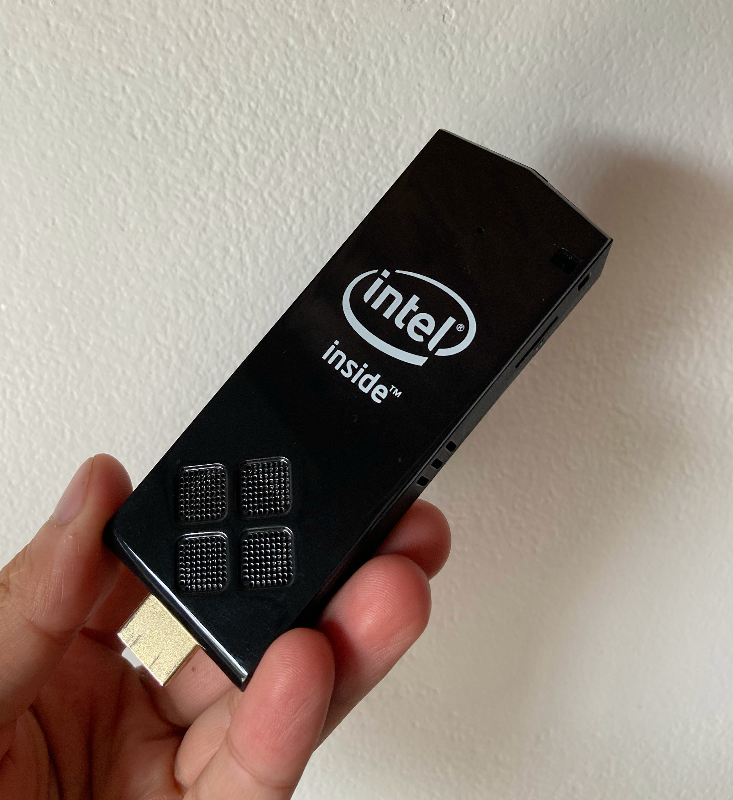
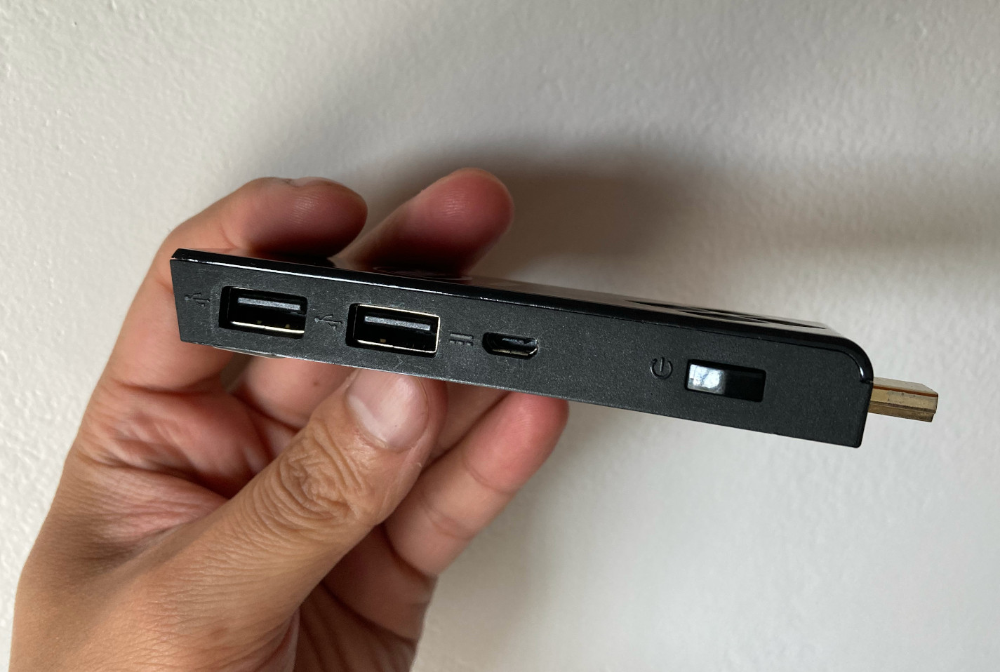
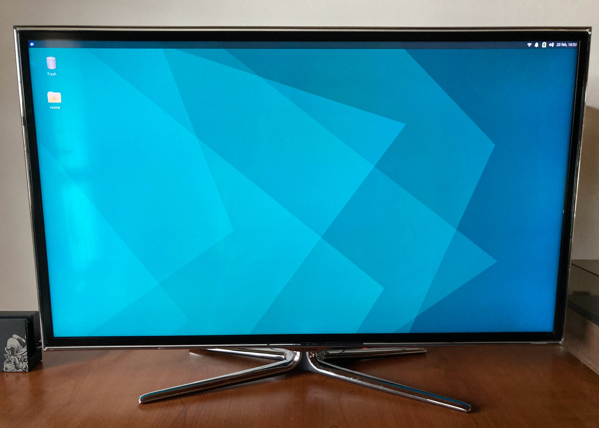
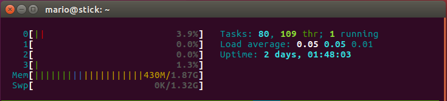

On my last vacation, I took the opportunity to spend more time with my family, go to the beach, read some books and resume old software projects (and also start new ones..)

On of those technological adventures included the opportunity to buy at a very good price an used Intel Stick

I have to recognize that I didn't know about their existence until I saw a picture in the marketplace and start to read about their [technical specifications](https://ark.intel.com/content/www/us/en/ark/products/86612/intel-compute-stick-stck1a32wfc.html). Surely considering the form factor they seemed fairly good at release date (Q1 2015) but for 2022 they seem limited at least

Basically an Intel(R) Atom(TM) CPU  Z3735F @ 1.33GHz with 2GB RAM and 32GB of flash storage. About connectivity: two USB ports and one Micro SD card is all you have

The project: Install a Linux flavor and remotely play videos and pictures on a TV

## Configuration

It was (originally?) configured with dual boot, Windows 10 home 32 bit and Android 4.x. Testing Windows this little computer clearly struggles to run it in an acceptable performance level. Android runs well but it looks incredible old (like in fact 10 years old :))

Also it is noisier than I expected. But in any case, it still amazes me to see products like this. A complete mini computer in such a small size

Next step: install Linux

I wish I had spent more time researching on this point. That 32 bits Windows was not only because of the 2GB of ram memory. But also because of the bios, In my case many unknown details here but it seemed by hardware boot time had to be in 32 bits

My first option was Debian 11. Thinking in a Debian XFCE desktop. Spoiler alert: I didn't get that far.. I successfully loaded the installer, formatted the drive and start the minimal installation. Everything looked good until it wasn't able to detect the Wifi. After some time trying different options I ended with a terminal installation with no network. Not what was intended and it clearly exceeded by far my limited Linux knowledge to find a solution to the missing Wifi

Then I tried another distros like XUbuntu (64 bit) with no success. It didn't even recognize the drive as bootable

That forced me to read and do more research, what I should have done from the beginning. I found the portal [https://linuxiumcomau.blogspot.com](https://linuxiumcomau.blogspot.com/2017/06/customizing-ubuntu-isos-documentation.html) and following some clearly explained steps I was able to generate an image of xubuntu 21.10 that successfully booted

Steps that worked for me: 

download isorespin_sh (http://url.linuxium.com.au/isorespin_sh)

    sudo mv isorespin.sh /usr/local/bin
    sudo chmod 755 /usr/local/bin/isorespin.sh

    sudo apt -y install p7zip-full bc klibc-utils iproute2 genisoimage dosfstools  
    sudo apt -y install squashfs-tools rsync unzip wget findutils xorriso bsdutils
        
Download a 64 bit linux flavor, for example: xubuntu-21.10-desktop-amd64.iso
        
	isorespin.sh -i xubuntu-21.10-desktop-amd64.iso --atom

It will generate a linuxium-xubuntu-21.10-desktop-amd64.iso image

On Windows and using [Rufus](https://rufus.ie/en/) create a booteable flash drive with "dd" mode using the newly created image

> Why Windows? I wasn't able to generate a bootable drive recognized by the stick on Linux. The following steps didn't work for me

    sudo umount /dev/<USB device>*
    sudo dd if=<respun ISO> of=/dev/<USB device> bs=4M

The installation took time but was a success

Install openssh-server and start playing remotely with the computer

## Now What?

The fun part, adding 'services' to a linux attached to a big screen. In a restricted economic way because of the limited resources

### Play Video

MPlayer is my choice. First define the display number, hdmi audio output and explicitely configure threads number according to the processor was key in my case to avoid the "your system is TOO slow to play this video" message and playback stops and quick catchups playing a video

    export DISPLAY=:0
    mplayer -fs -vo xv -ao alsa:device=hdmi -lavdopts threads=4 [video-file]

you can execute it from an ssh console, or write a simple program (example in Golang) to execute it for you, maybe as a REST api with a little html front end that based on a sqlite database shows a colection of video files that you can access from your mobile on your local network and order to play in the TV

			cmd = exec.Command("mplayer", "-fs", "-vo", "xv", "-ao", "alsa:device=hdmi", "-lavdopts", "threads=4", p)
			cmd.Stdout = os.Stdout
			if err := cmd.Run(); err != nil {
				fmt.Println("Error: ", err)
			}

### Images

This is a work in progress but the idea is to be able to view pictures or a slideshow of a specific album hosted in another computer (all family pictures). A little web application to search from my phone a picture or album and "Play on 'stick'" basically shows the picture or album on the TV where the intel stick is attached

For this experiment I'm using feh, here is an example of shoing fullscreen a local picture

    sudo apt install feh
    feh -F ./Pictures/563139.jpg

### Etc

I hosted little applications like [cookme](https://github.com/mamcer/cookme) an application to add and see recipes that I wrote in Go with a SQLite database during the most restrictive stage of the pandemic in 2020

Also I have made available some mp3 files through a shared folder

Using [youtube-dl](https://youtube-dl.org/) I have downloaded several official videos and live performances of my favourite artists and songs. During some tasks like cleanup or exercise I can easily play them on the TV with mplayer like having my own curated old music TV channel

Alternatively you can install deluge and deluge-web to download torrent files. In any case download is quick but copy files out of the stick trough the network is very slow also the limited disk space doesn't makes this option very interesting

## Resources

Playing HD video files can stress the available resourses maybe at the point that if you want to play a file smoothly you can't add any other task to the computer

In almost all other cases, using hosted applications, playing shared music, etc. The resource consumption is super low

Another example of stress is copying files. For example copying a large file through scp out of the stick could hit a 2.5 load average

## Final thoughts

I know I know, there are a lot of options out there, paid and free that do the same and a lot more several orders of magnitude better. As with most of this kind of projects I do it for fun and learning. They always challenge my current knowledge but mainly force me to learn at least something new to overcome an issue or challenge that always appear