My education was completely based on the public environment: elementary, high school, and university. With a lot of effort from my parents and people who helped me on the way. Particularly at the university, limited resources, and a crucial grade-based scholarship to continuing my studies, especially in the early years. But that's another story.

In that context, I find great programs like the one in place in Argentina until 2024, which allows teenagers in high school to have access to a free laptop. In many cases, as the first computer at their home, providing access to technology.

I never had one of those devices in my hands, but I was curious to understand how powerful it was for a teenager to learn programming.

I'm not an expert on the program, I understand that the latest hardware included some version of Windows and that much of its history was with a Debian-based Linux distribution developed for the program called [Huayra](https://huayra.educar.gob.ar/). I wanted to focus on the latter, especially considering the hardware limitations of these devices.

So I bought a refurbished laptop, an older model but very close to one of the latest devices of the program: a Latitude 3190, Intel Celeron N4100, 4GB RAM. I installed Debian 12 with Mate to simulate the program's distribution and the fun started.

It has that retro, nostalgic, and personally appealing look and feel. Which reminds me of the days of Ubuntu 0804. Alt-F2 for the launcher, Ctrl-Alt-T to open a terminal and get to work.

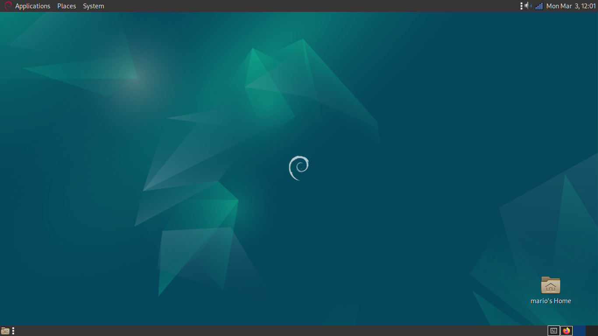

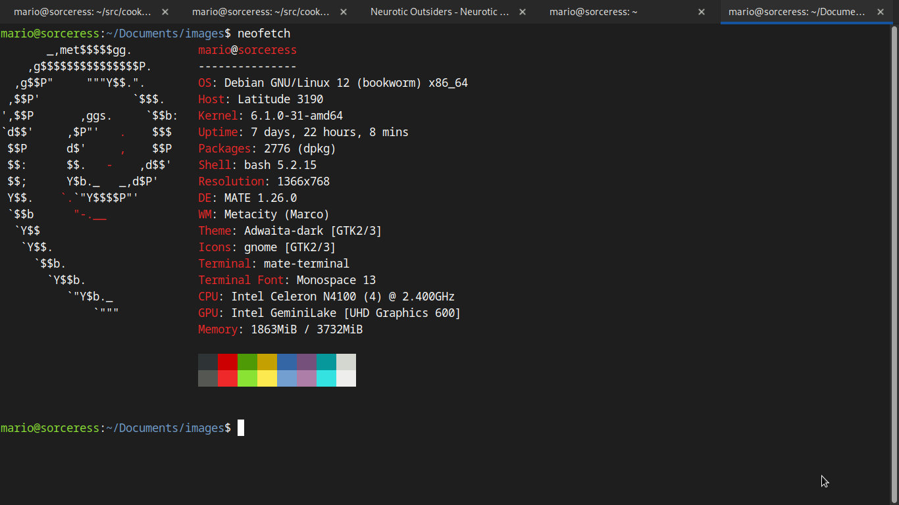

My first computer was a Celeron, back in the Pentium II era, another nostalgic touch. In any case it doesn't prevent to see the hardware limitations which are evident almost immediately, even on Debian with Mate desktop.

Unzipping a (large) tar file from the terminal

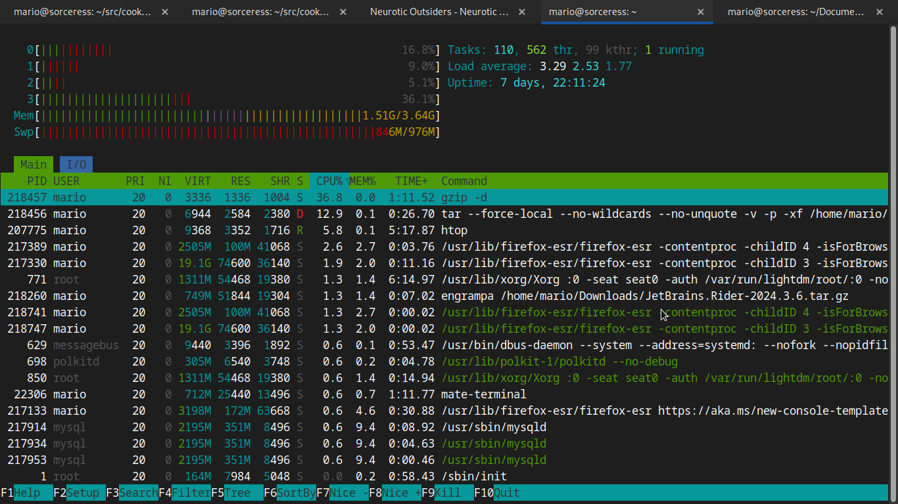

Development. Installing Git, Golang, Net Core, MyCli, Docker, and jq, no issues here.

Since several years ago my first choice for an IDE is Visual Studio Code. Developing in Golang, everything is perfect from a memory standpoint, although with strange crashes when I have VSCode with a project and Chromium open. In extreme cases, there were total freezes that required a hard restart. Coding sessions in VSCode with a browser open as support runs with the risk of these freezes. Personally, I like to use VSCode on one virtual desktop, a browser on another, and a program playing music on another.

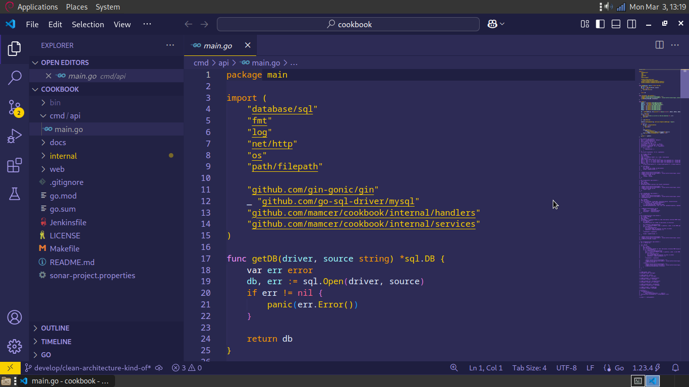

Developing with VSCode: possible.

Just by curiosity, I installed Rider for Net Core development. We are below the minimum recommended processor, and it runs like the minimum. Long start times, loading a simple project (literally a hello world) run for seconds that turned into minutes, and then a crash.

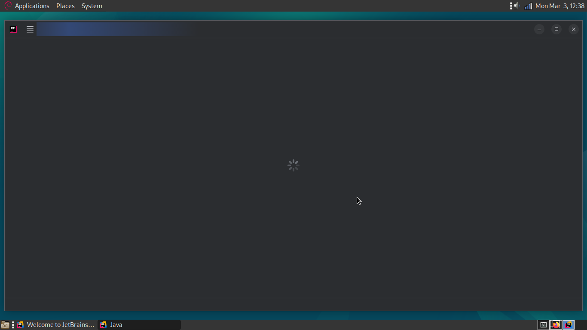

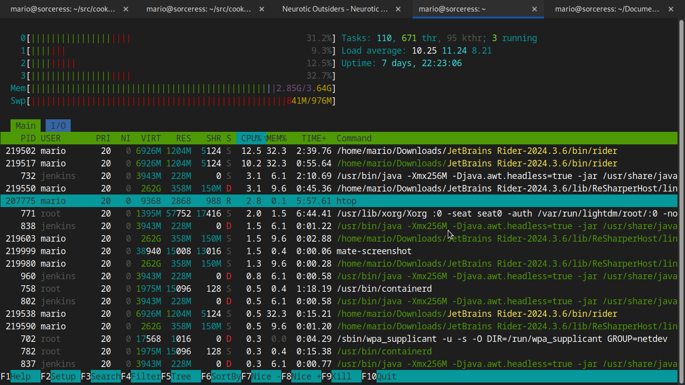

Here again, just like with Golang, developing Net Core in VSCode: feasible. Interestingly, the difference in build times for Golang-based projects versus Net Core seems much more noticeable on this computer.

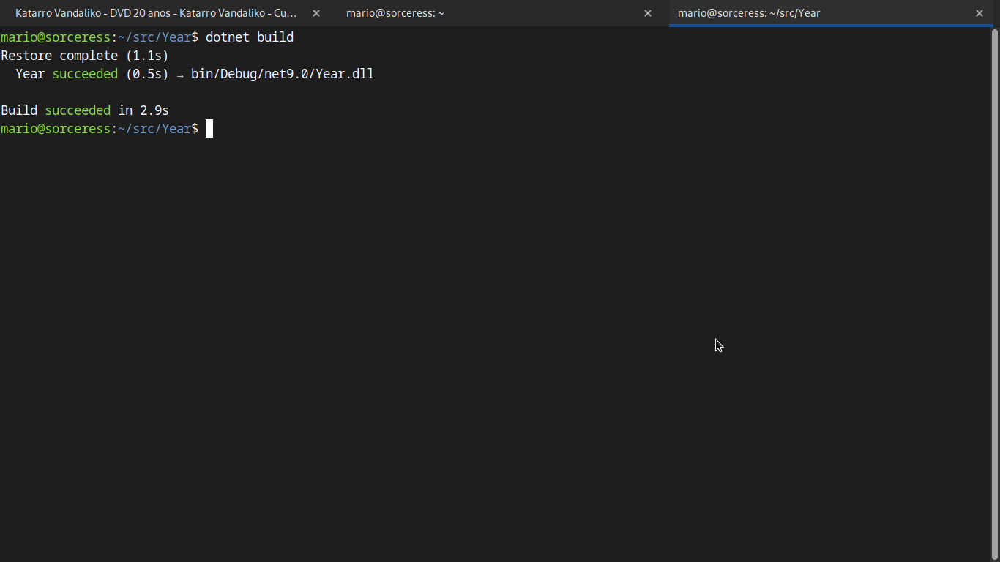

Outside of Rider, I haven't tested IntelliJ, Goland or another Jetbrains based IDE, but I assume a similar story and outcome as with Rider.

Going a little deeper on the path of resource saving in development: Vim. Vim-go for Golang development sounds like the natural choice.

As expected, excellent response times, especially working in TTY mode and only going to graphical mode as needed, for example to use a browser. Graphical mode allows you to use multiple virtual desktops or multiple tabs in a single terminal with Vim, another for Git, running tests or builds (you can do this from Vim, but I personally find it more convenient this way), MyCli for connecting to MySQL, another tab or virtual desktop with Cmus for music, the essentials :)

Summary: Vim with Vim-Go for Golang development, Docker, MyCli for connecting to MySQL, curl and jq for calling endpoints, and a browser works great.

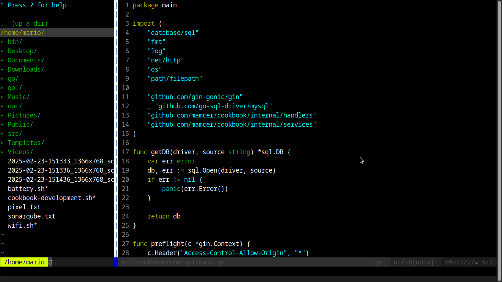

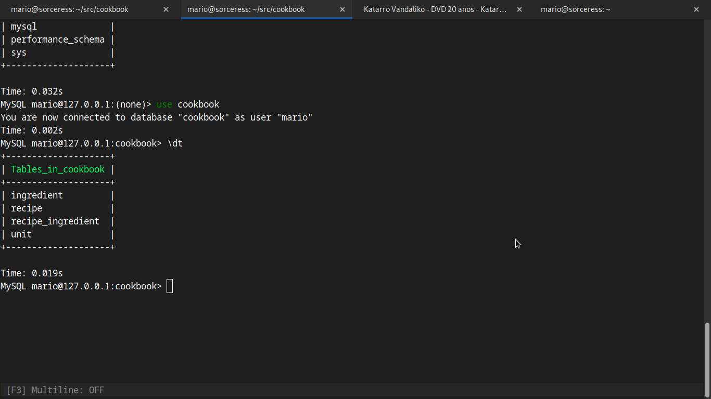

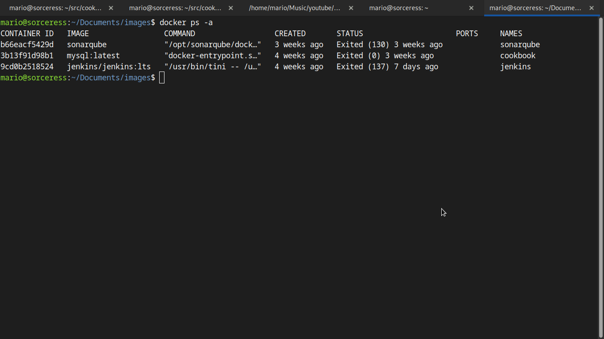

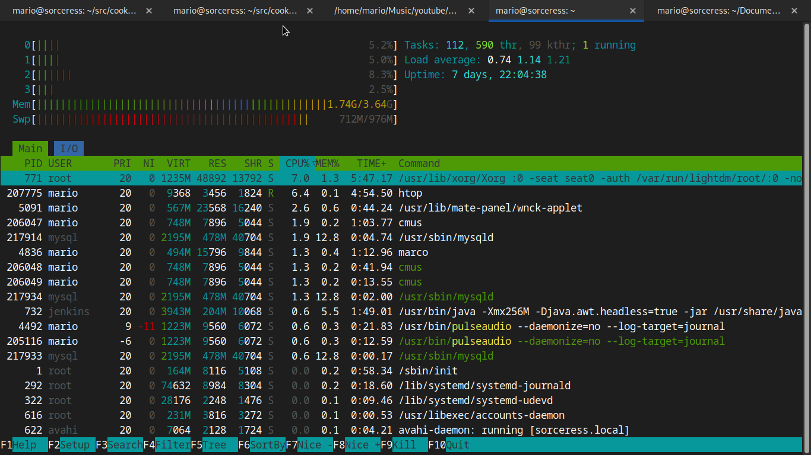

Super extra, you can use cloud services, but I tested Jenkins on the same computer over docker without problems (after tweaking JVM memory).

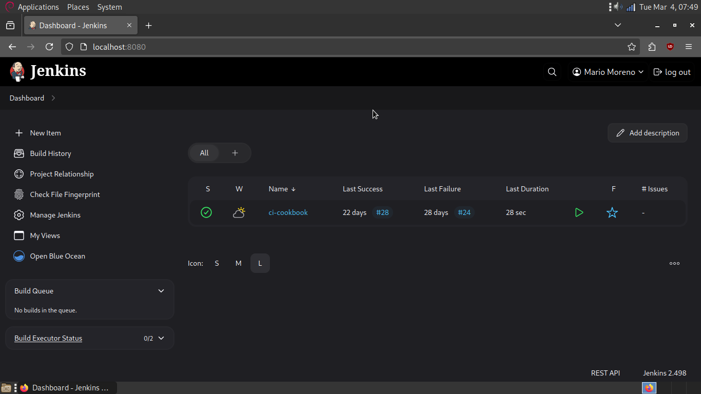

**Conclusion:** Yes, it is possible to learn a programming language and development in general on this kind of devices. But with several drawbacks. For example, VSCode as an IDE, along with a browser without too many open tabs, you may experience some glitches and even crashes. Expect an almost impossible experience with a more _professional_ IDE like Rider or IntelliJ. The totally best experience is based on Vim, along with MyCli, Docker, Golang and Net Core development. No issues, but I totally agree that this last option it's not for everyone and requires a steeper learning curve which can become a too tall barrier if you are taking your first steps in technology.